# AI/ML & Analytics in Regulated Industries
# Read Me

The example here shows how to operationalize a ML model in a secure manner industries such as in the financial, public & health sector but can also be extrapolated to any other industry.

In this particular example we will be using BigQuery, Composer, BigQuery ML and CMEK to provide greater control around encryption of the data in BigQuery. 

We will be using the Boosted Tree Classified model using [XGBoost](https://cloud.google.com/bigquery-ml/docs/reference/standard-sql/bigqueryml-syntax-create-boosted-tree) to classify the likelihood of a transaction being fraudulent or not. It will be using the ```bigquery-public-data:ml_datasets.ulb_fraud_detection``` dataset which contains anonymized credit card transactions made over 2 days in September 2013 by European cardholders, with 492 frauds out of 284,807 transactions.

We will not be covering VPC Security Contols in the example here, but you can have a look [here](https://cloud.google.com/vpc-service-controls/docs/service-perimeters) if you would like more information on how to get it setup for your environment.

## Setup and Requirements

- Access to GCP Project
- Create Google Cloud Storage Bucket
- Create a Composer Environment 
- Create and edit datasets and tables in BigQuery
- Setting up Cloud KMS

### 1. Create Cloud Composer Environment

Create a Cloud Composer environment 2 following the steps listed [here](https://cloud.google.com/composer/docs/composer-2/create-environments) to setup a Composer Environment in your project or run the following command via [gcloud](https://cloud.google.com/sdk/gcloud)

Firstly ensure the Composer API Service Agent service account has the required permissions

Because Cloud Composer 2 uses Workload Identity, the service account of your environment must have bindings to the Kubernetes service account that runs your environment's cluster. These bindings are needed so that pods of your environment cluster can access resources of your Google Cloud project. For example, to read DAG definition files from the environment's bucket.

To create bindings between your environment's service account and the Kubernetes service account of your environment's cluster, the Composer Service Agent account must have enough permissions to do so. This requires iam.serviceAccounts.getIamPolicy and iam.serviceAccounts.setIamPolicy permissions, which are provided by the **Cloud Composer v2 API Service Agent Extension** role. **This role is not granted automatically**. You must grant it manually once per project.

Once per project, add the **Cloud Composer v2 API Service Agent Extension** (roles/composer.ServiceAgentV2Ext) role to the Cloud Composer Service Agent account. Keep the existing **Composer API Service Agent** role on this service account, it must have both roles.

```
gcloud projects add-iam-policy-binding {PROJECT_ID} \
    --member serviceAccount:service-{PROJECT_NUMBER}@cloudcomposer-accounts.iam.gserviceaccount.com \
    --role roles/composer.ServiceAgentV2Ext
```

Now to create the Composer 2 environment with Airflow 2 copy the below command into your Cloud Shell

```
gcloud composer environments create composer-rp-demo  \
    --location us-central1 \
    --image-version "composer-2.0.0-preview.3-airflow-2.1.2"
```
	This will take about 20 minutes to complete, follow the steps below in the meantime

### 2. Setup Cloud KMS Key Ring and Key

Go to the GCP console, in the hamburger menu go to Security > Key Management

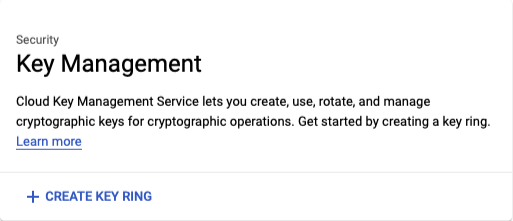

Click on ‘CREATE KEY RING’


Specify a Key ring name - ‘regulated-pipelines’ as an example

Set the key ring location as ‘us’

Create Cloud KMS Key
Go to the GCP console, in the hamburger menu go to Security > Key Management

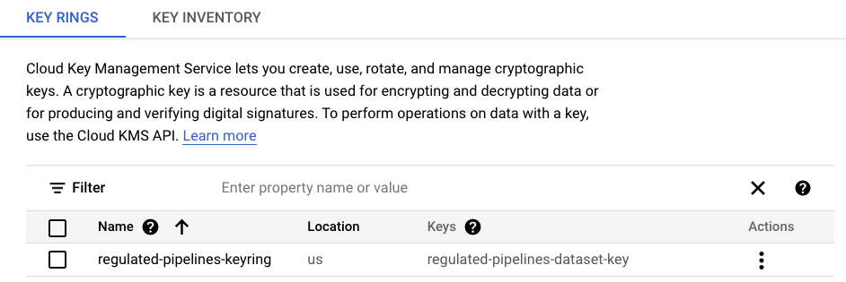

Click on to ‘regulated-pipelines’ and Click on ‘CREATE KEY’

Specify the key name - ‘regulated-pipelines-dataset-key’ and leave the other options as is such as 

Protection level ‘Software’ - this can also be ‘HSM’ if you are using a Hardware Security Module.
Purpose - ‘Symmetric encrypt/decrypt’
Key rotation period - ‘90 days’

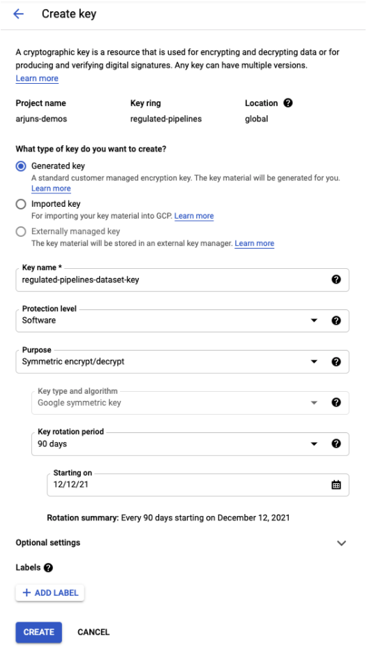

### 3. Setup BigQuery service account to access and work with KMS

Your BigQuery service account is not initially created when you create a project. To trigger the creation of your service account, enter a command that uses it, such as the ```bq show --encryption_service_account```
 For example:

```
bq show --encryption_service_account --project_id=[PROJECT_ID]

bq-{PROJECT_NUMBER}@bigquery-encryption.iam.gserviceaccount.com

```

Assign the Cloud KMS CryptoKey Encrypter/Decrypter role to the BigQuery system service account that you copied to your clipboard. This account is of the form

```​​bq-{PROJECT_NUMBER}@bigquery-encryption.iam.gserviceaccount.com```

You can use the gcloud command-line tool to assign the role:

```
gcloud kms keys add-iam-policy-binding \
--project={KMS_PROJECT_ID} \
--member serviceAccount:bq-{PROJECT_NUMBER}@bigquery-encryption.iam.gserviceaccount.com \
--role roles/cloudkms.cryptoKeyEncrypterDecrypter \
--location={KMS_KEY_LOCATION} \
--keyring={KMS_KEY_RING} \
{KMS_KEY}
```

Replace the following:
**{KMS_PROJECT_ID}**: the ID of your Google Cloud project that is running Cloud KMS
**{PROJECT_NUMBER}**: the project number (not project ID) of your Cloud project that is running BigQuery
**{KMS_KEY_LOCATION}**: the location name of your Cloud KMS key, in this example we will be using {US}
**{KMS_KEY_RING}**: the key ring name of your Cloud KMS key
**{KMS_KEY}**: the key name of your Cloud KMS key


### 4. Create a BigQuery dataset with CMEK

Create a BigQuery dataset with CMEK following the steps listed [here](https://cloud.google.com/bigquery/docs/datasets#bq) or run the following gsutil command

```
bq --location=US mk \
--default_kms_key projects/{KMS_PROJECT_ID}/locations/{LOCATION}/keyRings/{KEY_RING}/cryptoKeys/{KEY} \
--dataset rp_demo_cmek
```

### 5. Check the Composer Environment is up and running

Go to the GCP console, in the hamburger menu go to Composer

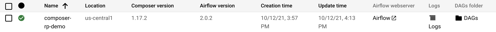

Under the Airflow webserver, click on the link to take you to the UI

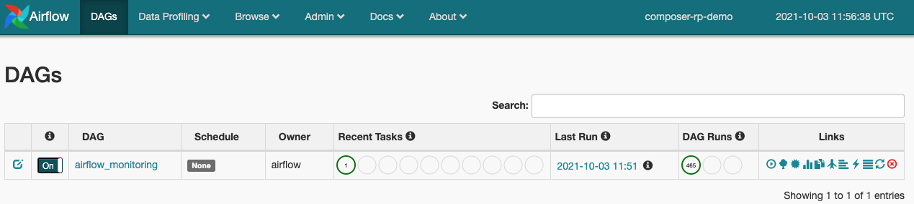

You will notice there is only one DAG called **airflow_monitoring** that is a test dag that has an echo statement that says ```echo test```
Setting up CMEK for Composer
 
### 6. (Optional) Setting up CMEK for Composer

If you would also like to setup CMEK for Composer, you can follow the steps listed [here](https://cloud.google.com/composer/docs/cmek)
 

### 7. Setting up Airflow Variables 

Go to the GCP console, in the hamburger menu go to Composer

Under the Airflow webserver, click on the link to take you to the UI

In the Airflow UI, go to **Admin** > **Variables**

Click on the **+** to create a new record

Firstly, we will be creating the ```gcp_project_id``` variable

Please enter in the **val** field your GCP Project ID and click on **Save**

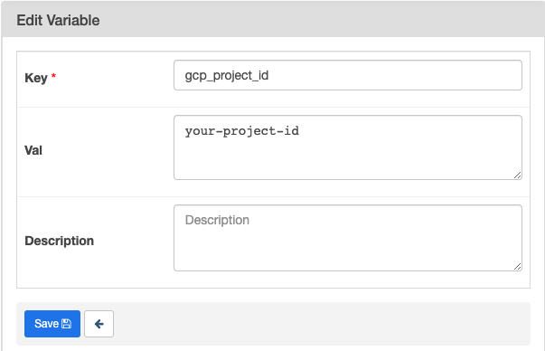

Secondly, click on the **+** to create a new record

We will now be creating the ```bigquery_dataset``` variable

Please enter in the **val** field your BigQuery dataset which will be ```rp_demo_cmek``` and click on **Save**


### 8. Upload DAG to Composer Bucket

Go to the GCP console, in the hamburger menu go to Composer

Under the column **DAGs folder** for the environment ```composer-rp-demo```, click on to DAGs link to acccess the DAG bucket.

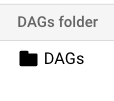


This will be the end folder structure once the files have been uploaded

    |-dags
       |- rp-dag-bqml-fraud.py
       |- include
            |- ulb_fraud_20_pcnt_sample.sql
            |- ulb_fraud_80_pcnt_sample_training.sql
            |- create_xgboost_fraud_model.sql
            |- run_xgboost_fraud_model.sql

This is where you will be uploading your DAG along with the SQL scripts that will be creating the sample data and BQML models.

To start off, go to the Cloud Shell and you will be using gcloud copy the repo locally in your shell

``` git clone https://github.com/GoogleCloudPlatform/python-docs-samples.git```

In the Cloud Shell, you will copy the DAG and SQL includes to the Composer DAG folder

Change to the directory where the DAG and the SQL includes live

```
cd composer/blog/gcp-tech-blog/regulated-industries-pipelines
```

Here is the command to copy into your shell,

Firstly copying over the SQL includes :

```
gcloud composer environments storage dags import \
    --environment composer-rp-demo \
    --location us-central1  \
    --source ./dags/include/
```

Secondly copy over the DAG itself

```
gcloud composer environments storage dags import \
    --environment composer-rp-demo \
    --location us-central1  \
    --source ./dags/regulated_pipelines_blog_bqml_dag.py
```

Currently the DAG is set to a weekly trigger, once uploaded you will need to go to the Airflow UI to trigger the DAG manually if you want it to run now

Navigate to **Composer** > **Airflow webserver**

You will see the following DAG appear ```ulb_bqml_xgboost_fraud_dag```

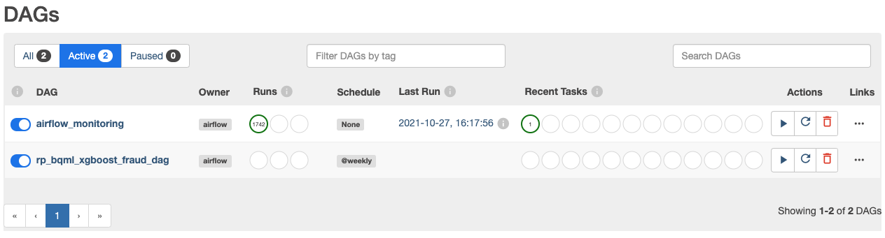

You will need to click on the play button to trigger the data and you will see it running as below 


Once the DAG has fully completed executing all the tasks, click on to it see if all tasks are complete

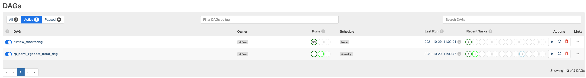

Once the DAG has executed, you can navigate to BigQuery to see the results of your model saved


### 9. Output of Model and Classifications in BigQuery

Navigate over to BigQuery from the hamburger menu

Under your project, you should see the ```rp_demo_cmek``` dataset

If you click on it amd click on the 3 dots to open the dataset you should be presented with the following :

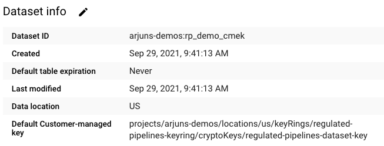

and expand it you should see the following

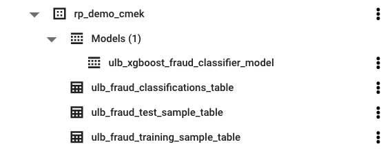

You can now explore and evaluate the output of the model using SQL via the BigQuery UI

Click on **COMPOSE NEW QUERY** on the top right hand corner in the BigQuery UI


Then paste the following SQL Statement to query the dataset to get a view as to how many transactions were classified correctly :

```
SELECT
  predicted_Class,
  Class,
  COUNT(*) AS Total
FROM
  `rp_demo_cmek.ulb_fraud_classifications_table`
GROUP BY 1,2
```

This will output the following results :

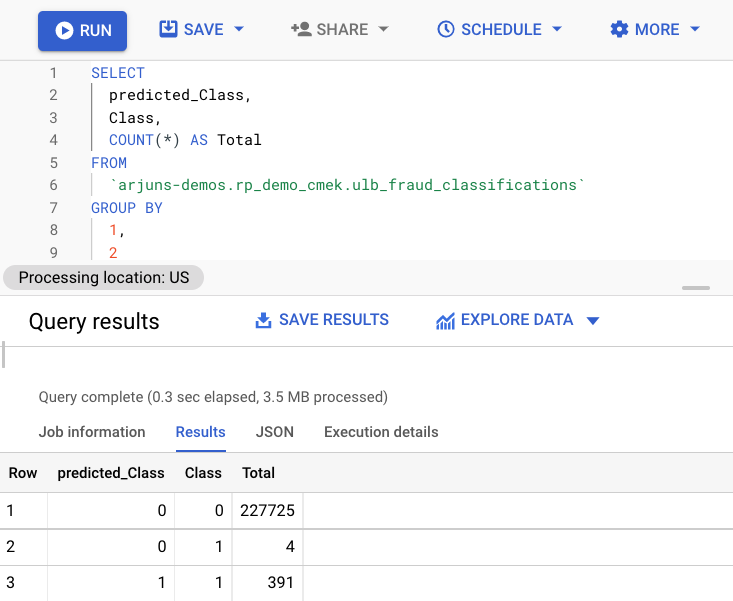

This hopefully should give you an overview on how to build and operationalize a BQML model and enforce more granular controls on your BigQuery using CMEK

You could operationalize this using Scheduled queries but it does not give you the same level of granularity from a monitoring perspective as Airflow does, or can be extended also

to integrate with other services to send emails, notifications etc or export the results to a GCS bucket to send the data elsewhere.