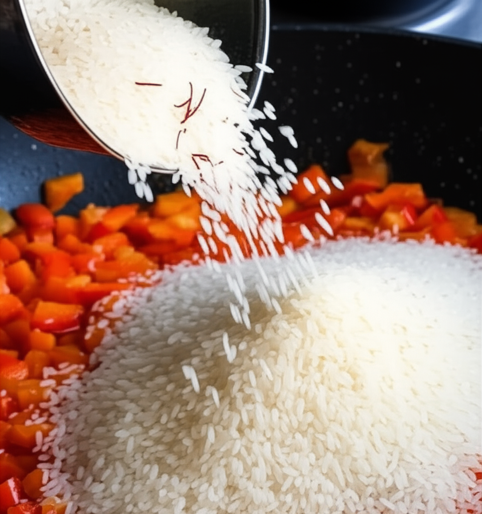

Okay, I will generate an illustrated recipe for paella, creating an image for each step.

**Step 1: Gather Your Ingredients**

An overhead shot of a rustic wooden table displaying all the necessary ingredients for paella. This includes short-grain rice, chicken thighs and drumsticks, chorizo sausage, shrimp, mussels, clams, a red bell pepper, a yellow onion, garlic cloves, peas (fresh or frozen), saffron threads, paprika, olive oil, chicken broth, a lemon, fresh parsley, salt, and pepper. Each ingredient should be clearly visible and arranged artfully.

**Step 2: Prepare the Vegetables and Meat**

An image showing hands chopping a yellow onion on a wooden cutting board, with a diced red bell pepper and minced garlic in separate small bowls nearby. In the background, seasoned chicken pieces and sliced chorizo are ready in other bowls.

**Step 3: Sauté the Chicken and Chorizo**

A close-up shot of a wide, shallow paella pan over a stove burner. Chicken pieces are browning in olive oil, and slices of chorizo are nestled amongst them, releasing their vibrant red color and oils.

**Step 4: Add Vegetables and Aromatics**

The paella pan now contains sautéed onions and bell peppers, softened and slightly translucent, mixed with the browned chicken and chorizo. Minced garlic and a pinch of paprika are being stirred into the mixture.

**Step 5: Introduce the Rice and Saffron**

Short-grain rice is being poured into the paella pan, distributed evenly among the other ingredients. A few strands of saffron are being sprinkled over the rice, adding a golden hue.

**Step 6: Add the Broth and Simmer**

Chicken broth is being poured into the paella pan, completely covering the rice and other ingredients. The mixture is starting to simmer gently, with small bubbles forming on the surface.

**Step 7: Add Seafood and Peas**

Shrimp, mussels, and clams are being carefully arranged on top of the rice in the paella pan. Frozen peas are being scattered over the surface. The broth has reduced slightly.

**Step 8: Let it Rest**

A finished paella in the pan, off the heat and resting. The rice looks fluffy, the seafood is cooked, and the mussels and clams have opened. Steam is gently rising from the dish. A lemon wedge and some fresh parsley sprigs are placed on top as a garnish.

**Step 9: Serve and Enjoy!**

A portion of the vibrant paella is being served onto a plate, showcasing the different textures and colors of the rice, seafood, meat, and vegetables. A lemon wedge and a sprinkle of fresh parsley complete the serving.

