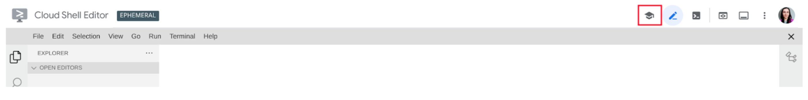

#Retail Search Interactive Tutorials

##Run tutorials in Cloud Shell

To advance with the interactive tutorials, use Retail Search step-by-step manuals on the right side of the Cloud Shell IDE: 


The interactive tutorial should open by default. If it didn’t, click on the Tutorial symbol in the menu bar to open the step-by-step manual:


For more details about the Cloud Shell environment, refer to the [Cloud Shell documentation](https://cloud.google.com/shell/docs).

## Interactive tutorial flow

Interactive guides are intended to help you understand the features provided by Google Cloud Retail Search and test the Retail API in action.

To proceed with the tutorial, choose a language you’ll be deploying your project in:


To begin with the tutorial workflow, click the Start button:


Then, you can use Next and Previous buttons to navigate the tutorial pages.

## Get started with the Google Cloud Retail API

The Retail API provides you with the following possibilities to: 
  - Create and maintaining the catalog data. 
  - Fine-tune the search configuration.
  - Import and maintain the user events data.

You can find the information about the Retail services in the [documentation](https://cloud.google.com/retail/docs)

<!--TODO(tkarasova) update the link to the tutorials when will be published-->
If you would like to have a closer look at the Retail API features and try them yourself,
the best option is to use the [Interactive Tutorials](https://cloud.google.com/retail/docs/overview). The tutorials will be launched in the CloudShell environment, and you will be able to request the Retail services and check the response with minimum time and effort.

The code samples in the directory **python-retail/samples/interactive-tutorials** are explicitly created for use with the Retail Interactive Tutorials.

If, for some reason, you have decided to proceed with these code samples without the tutorial, please go through the following steps and set up the required preconditions.

### Select your project and enable the Retail API

Google Cloud organizes resources into projects. This lets you
collect all the related resources for a single application in one place.

If you don't have a Google Cloud project yet or you're not the owner of an existing one, you can
[create a new project](https://console.cloud.google.com/projectcreate).

After the project is created, set your PROJECT_ID to a ```project``` variable.
1. Run the following command in Terminal:
    ```bash
    gcloud config set project <YOUR_PROJECT_ID>
    ```

1. To check that the Retail API is enabled for your Project, go to the [Admin Console](https://console.cloud.google.com/ai/retail/).

### Create service account

To access the Retail API, you must create a service account.

1. To create a service account, follow this [instruction](https://cloud.google.com/retail/docs/setting-up#service-account)

1. Find your service account on the [IAM page](https://console.cloud.google.com/iam-admin/iam),
   click `Edit` icon, add the 'Storage Admin' and 'BigQuery Admin' roles. It may take some time for changes to apply.

1. Copy the service account email in the Principal field.

### Set up authentication

To run a code sample from the Cloud Shell, you need to be authenticated using the service account credentials.

1. Login with your user credentials.
    ```bash
    gcloud auth login
    ```

1. Type `Y` and press **Enter**. Click the link in a Terminal. A browser window should appear asking you to log in using your Gmail account.

1. Provide the Google Auth Library with access to your credentials and paste the code from the browser to the Terminal.

1. Upload your service account key JSON file and use it to activate the service account:

    ```bash
    gcloud iam service-accounts keys create ~/key.json --iam-account <YOUR_SERVICE_ACCOUNT_EMAIL>
    ```

    ```bash
    gcloud auth activate-service-account --key-file ~/key.json
    ```

1. To request the Retail API, set your service account key JSON file as the GOOGLE_APPLICATION_CREDENTIALS environment variable :
    ```bash
    export GOOGLE_APPLICATION_CREDENTIALS=~/key.json
    ```

### Install Google Cloud Retail libraries

To run Python code samples for the Retail API tutorial, you need to set up your virtual environment.

1. Run the following commands in a Terminal to create an isolated Python environment:
    ```bash
    pip install virtualenv
    virtualenv myenv
    source myenv/bin/activate
    ```
1. Next, install Google packages:
    ```bash
    pip install google
    pip install google-cloud-retail
    pip install google-cloud-storage
    pip install google-cloud-bigquery

    ```

## Import Catalog Data

This step is required if this is the first Retail API Tutorial you run.
Otherwise, you can skip it.

### Upload catalog data to Cloud Storage

There is a JSON file with valid products prepared in the `product` directory:
`product/resources/products.json`.

Another file, `product/resources/products_some_invalid.json`, contains both valid and invalid products, and you will use it to check the error handling.

In your own project, create a Cloud Storage bucket and put the JSON file there.
The bucket name must be unique. For convenience, you can name it `<YOUR_PROJECT_ID>_<TIMESTAMP>`.

1. To create the bucket and upload the JSON file, run the following command in the Terminal:

    ```bash
    python product/setup_product/create_gcs_bucket.py
    ```

    Now you can see the bucket is created in the [Cloud Storage](https://console.cloud.google.com/storage/browser), and the files are uploaded.

1. The name of the created Retail Search bucket is printed in the Terminal. Copy the name and set it as the environment variable `BUCKET_NAME`:

    ```bash
    export BUCKET_NAME=<YOUR_BUCKET_NAME>
    ```

### Import products to the Retail Catalog

To import the prepared products to a catalog, run the following command in the Terminal:

```bash
python product/import_products_gcs.py
```

## Run your code sample

Run the sample in a terminal with the following command:
```bash
python search/search_with_boost_spec.py
```