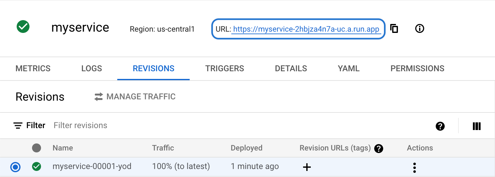
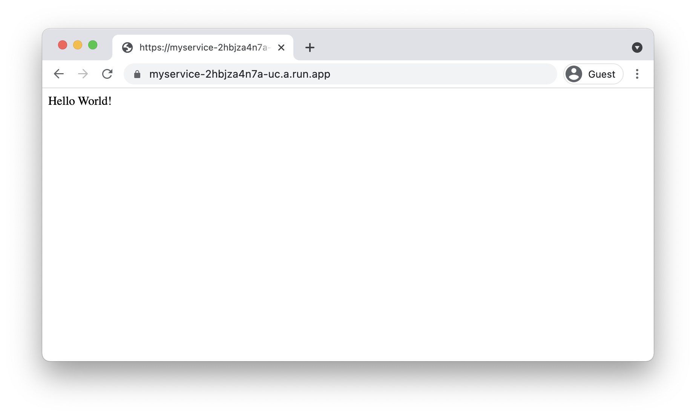
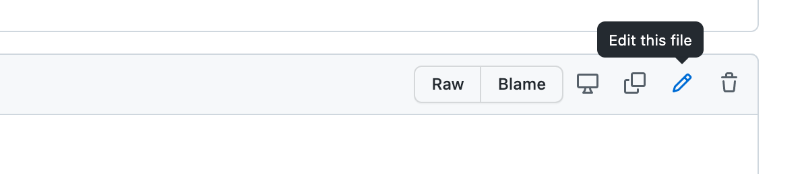
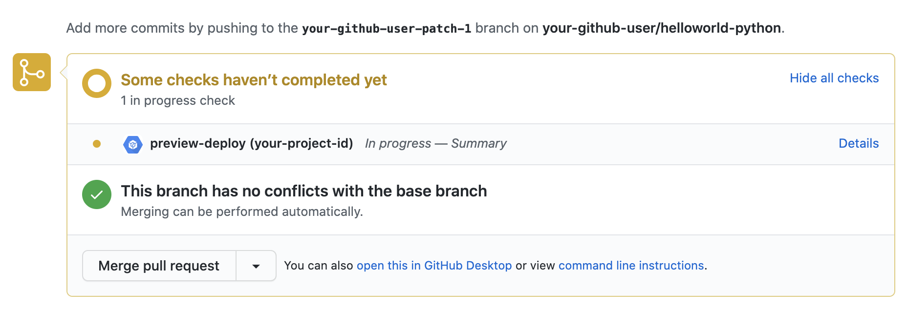
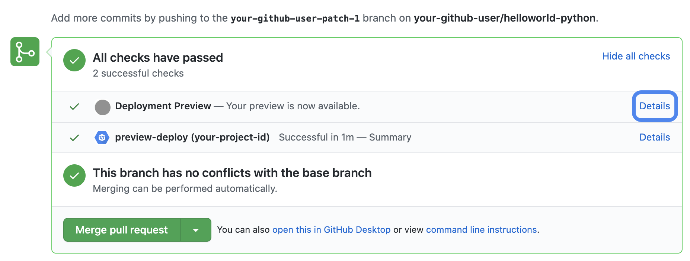
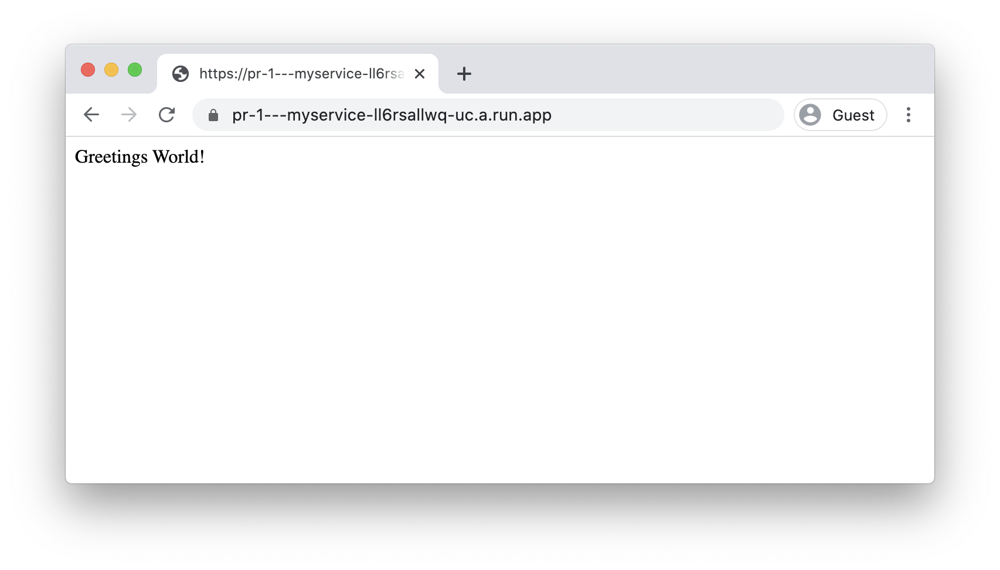
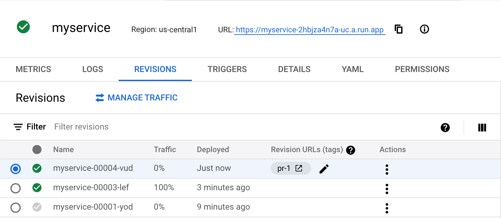
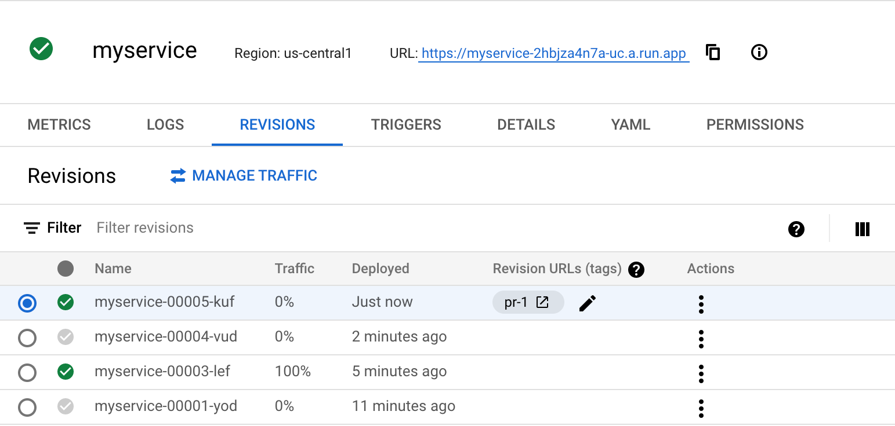
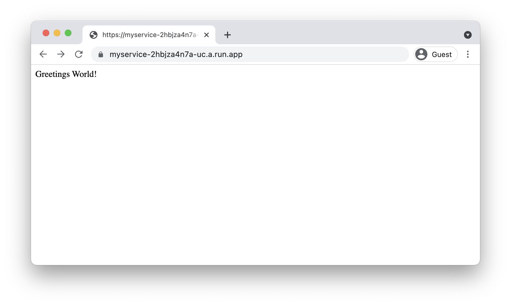
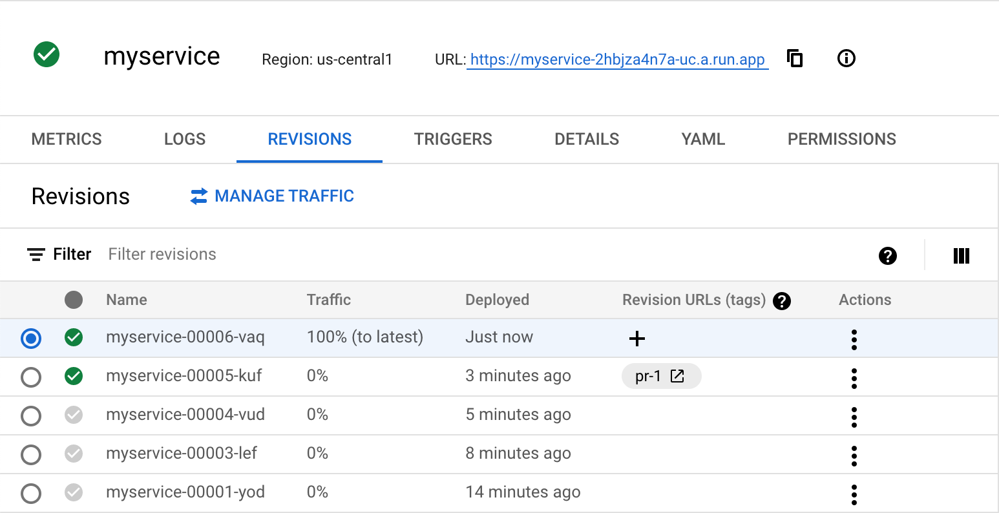

# Configuring deployment previews

This tutorial shows you how to use [Cloud Run revision
URLs](https://cloud.google.com/run/docs/rollouts-rollbacks-traffic-migration#tags)
to implement previews of GitHub pull requests through [Cloud Build
triggers](https://cloud.google.com/build/docs/automating-builds/create-github-app-triggers).
Previews allow you to deploy potential changes to a service without changing the
live or 'production' version of the service. By deploying a 0% traffic revision
of an opened pull request, you are able to preview the change and ensure it
works as intended in a near-production environment before merging.

This tutorial works with both public and private GitHub repos. Note that the
previews themselves will be public, if obscure, URLs.

## Objectives

*   Create a Cloud Run service.
*   Implement source-control based continuous integration on GitHub.
*   Create and manage access to secrets via Secret Manager.
*   Deploy a custom Cloud Builder.
*   Create a Cloud Build trigger to invoke builds on GitHub pull requests.


## Costs

In this tutorial, you use the following billable components of Google Cloud:


* [Cloud Build](https://cloud.google.com/build)
* [Cloud Run](https://cloud.google.com/run)
* [Artifact Registry](https://cloud.google.com/artifact-registry)
* [Secret Manager](https://cloud.google.com/secret-manager)

To generate a cost estimate based on your projected usage, use the [pricing
calculator](https://cloud.google.com/products/calculator).


## Before you begin

* In the Google Cloud console, on the project selector page, select or [create a
  Google Cloud
  project](https://cloud.google.com/resource-manager/docs/creating-managing-projects).

* [Make sure that billing is enabled for your Google Cloud
  project.](https://cloud.google.com/billing/docs/how-to/verify-billing-enabled#console)
* [Enable the Cloud Run, IAM, Cloud Build, Artifact Registry, and Secret Manager
  APIs.](https://console.cloud.google.com/flows/enableapi?apiid=run.googleapis.com,iam.googleapis.com,cloudbuild.googleapis.com,secretmanager.googleapis.com,artifactregistry.googleapis.com)

### Required roles

To get the permissions that you need to complete the tutorial, ask your
administrator to grant you the following IAM roles on your project:

* Cloud Build Editor (`roles/cloudbuild.builds.editor`) 
* Cloud Run Admin (`roles/run.admin`)
* Create Service Accounts (`roles/iam.serviceAccountCreator`)
* Secret Manager Admin (`roles/secretmanager.admin`)
* Artifact Registry Admin (`roles/artifactregistry.admin`)

For more information about granting roles, see [Manage
access](https://cloud.google.com/iam/docs/granting-changing-revoking-access).

You might also be able to get the required permissions through [custom
roles](https://cloud.google.com/iam/docs/creating-custom-roles) or other
[predefined roles](https://cloud.google.com/iam/docs/understanding-roles).


## Retrieving the code sample

For ease of use in this tutorial, you will create a new GitHub repository with a
copy of a Hello World application based on a template. You will then add a new
file to this repo with the custom Cloud Build configuration.

1. Log into GitHub and navigate to the [template
   repo](https://github.com/GoogleCloudPlatform/cloud-run-microservice-template-python).
1. Create a new repo using this template by clicking "Use this template".
    1. Name your repo `helloworld-python`.
    1. Choose either "Public" or "Private" for the repo.
    1. Click **Create repository from template**.
1. Create a new Cloud Build configuration file in your repo ([full
   instructions](https://docs.github.com/en/free-pro-team@latest/github/managing-files-in-a-repository/creating-new-files)):
    1. On your repo page, click **Add file** > **Create new file**
    1. Name the new file `cloudbuild.yaml`
    1. Copy the code to `cloudbuild.yaml`:
       [cloudbuild.yaml](/run/deployment-previews/cloudbuild-configurations/cloudbuild.yaml)
    1. Keep the default "Commit directly into the `main` branch" selection.
    1. Click **Commit new file**.


## Deploying your service with a build trigger

This tutorial shows shows how to set up a build trigger to start a build
automatically each time you update the main branch of your repository. You can
also deploy your service manually by invoking [Cloud
Build](https://cloud.google.com/build/docs/deploying-builds/deploy-cloud-run#building_and_deploying_a_container)
each time you want to deploy a change.

For this tutorial, use the `cloudbuild.yaml` file to deploy a sample service
called `myservice`.

### Creating a service account

This tutorial opts to use a dedicated service account that will be used by the Cloud Build triggers. 

1. In the Google Cloud console, go to the [Service Account settings](https://console.cloud.google.com/iam-admin/serviceaccounts).
1. Click **Create service account**
1. Enter the folloiwing details: 
    * Name: `cloudbuild-sa`
    * Description: `Cloud Build Trigger Service Account`
1. Click **Create and continue**
1. In "Grant this service account access to the project", select the following roles: 
    * "Logs Writer" (allows writing logs to Cloud Logging)
    * "Artifact Registry Writer" (allows creating and publishing containers to Artifact Registry)
    * "Cloud Run Developer"  (allows creating and updating Cloud Run services)
    * "Service Account User" (allows running operations as the service account)
1. Click **Done**. 

### Creating a trigger

1. Connect your GitHub account to Cloud Build ([full
   instructions](https://cloud.google.com/build/docs/automating-builds/run-builds-on-github)):
    1. In the Google Cloud console, go to the [Cloud Build
       triggers](https://console.cloud.google.com/cloud-build/triggers) page.
    1. Click **Connect Repository**.
    1. Select **GitHub (Cloud Build GitHub App)** as the source, and step
    through the authentication and authorization dialogs.
    1. Select the `GITHUB_USER_NAME/helloworld-python` repository.
    1. Click **Connect repository**.
    1. In "Create a trigger", click **Create a trigger**.
1. Create a Cloud Build trigger ([full
   instructions](https://cloud.google.com/build/docs/automating-builds/create-manage-triggers#console)):
    1. In the Cloud Build triggers page, click **Create trigger**.
    1. Enter in the following details:
        *   Name: `prod-deploy`
        *   Event: Push to Branch
        *   Source Repository: `GITHUB_USER_NAME/helloworld-python`
        *   Source Branch: `^main$`
        *   Build Configuration: Cloud Build configuration file (yaml or json)
        *   Cloud Build configuration file location: `cloudbuild.yaml`
        *   Service Account: `cloud-build-sa@MYPROJECT.iam.gserviceaccount.com`
    1. Click **Create**.

    Note: You can optionally select "Send build logs to GitHub". Build logs will be visible to any GitHub user with read access to the repository.

1. Run the new trigger manually:
    1. On the new trigger listing, click **Run**.
    1. In the popup, confirm the branch name (`main`), and click **Run
       Trigger**.
    1. Check the progress of the build by going to the [Cloud Build
    history.](https://console.cloud.google.com/build/builds)
    1. Wait for the build to complete.
1. Confirm successful deployment.
    1. In the Google Cloud console, go to the **[Cloud
       Run](https://console.cloud.google.com/run)** page.
    1. Confirm that the service has a green check mark showing successful
       deployment.
    1. Click the **Revisions** tab and confirm that the service has one
    revision, serving 100% of traffic, starting with "myservice-00001-".
    1. Click on the service's URL and confirm that the service displays "Hello
       World!".

  

  


## Creating tokens and configurations

The **prod-deploy** trigger created in the previous section deploys the service
when a push is made to the main branch. You will now create a second trigger
that runs whenever a pull request is created or updated in your repo.

After the new trigger is set up, the preview will be deployed, but there will be
no information in the pull request to link to the preview. To set up this
functionality, you need to complete the following additional configuration
steps:

* Create a GitHub token
* Store this token in Secret Manager
* Create a custom image to use as a step in Cloud Build.

### Creating and storing a GitHub Token

1. Create a GitHub token to allow writing back to a pull request ([full
   instructions](https://docs.github.com/en/github/authenticating-to-github/creating-a-personal-access-token#creating-a-token)):
    1. Go to the [GitHub Personal Access
       token](https://github.com/settings/tokens) settings page.
    1. Click **Generate new token (classic)**.
    1. Enter the following details:
        * **Note**: `preview-deploy`
        * **Expiration**: 30 days
        * **Scope**:
           * For a public repo: `repo:status` ("Access commit status")
           * For a private repo: `repo` ("Full control of private repositories")
    1. Click **Generate token**.
    1. Copy the value of the generated token.
1. Store the GitHub token in Secret Manager:
    1. In the Google Cloud console, go to the **[Secret Manager](https://console.cloud.google.com/security/secret-manager)** page.
    1. Click **Create Secret**.
    1. Enter the following details:
      1. Name: `github_token`.
      1. Secret value: paste the token value you copied from GitHub.
    1. Click **Create Secret**.
    
1. Allow the service account access to this secret, replacing `MYPROJECT` with your project ID:
    1. In Secret Manager, and click on the **Permission** tab, and click
    **Grant Access**
        *   New Principals: `cloud-build-sa@MYPROJECT.iam.gserviceaccount.com`
        *   Role: Secret Manager Secret Accessor
    1. Click **Save**.


GitHub recommends [setting
expiration](https://github.blog/changelog/2021-07-26-expiration-options-for-personal-access-tokens/)
for personal access tokens, and will send reminder emails when tokens are set to
expire. If you continue to use deployment previews, create a new version of the
`github_token` when you regenerate your token. The builder in the next step
retrieves the latest version of the token, so the previews will continue to
work.

### Creating a new image for Cloud Build

The script that writes the "Deployment Preview" notification to the pull request
is located within the [Python Docs
Samples](https://github.com/GoogleCloudPlatform/python-docs-samples/tree/master/run/deployment-previews).
Instead of adding this script into your source code, you can optionally build
this script into a container within your project and run that container as a
step in your Cloud Build configuration.

You can complete the following instructions using either [Cloud
Shell](https://console.cloud.google.com/?cloudshell=true), or your local machine
if you have installed and configured `git` and Google Cloud CLI. The
instructions below show both methods.


* Configure Google Cloud CLI to use your project, replacing
  `MYPROJECT` with your project ID:

    ```
    export PROJECT_ID=MYPROJECT
    gcloud config set project $PROJECT_ID
    ```

    If using Cloud Shell, you may need to authorize Google Cloud CLI to make a
    Google Cloud API call. Click <b>Authorize</b> to allow this action to
    proceed.
* Create a new Artifact Registry for your containers: 

    ```
    gcloud artifacts repositories create containers \
      --location us-central1 \
      --repository-format "docker"
    ```

* Create a new container image:

    ```
    git clone https://github.com/GoogleCloudPlatform/python-docs-samples
    cd python-docs-samples/
    gcloud builds submit --tag us-central1-docker.pkg.dev/$PROJECT_ID/containers/deployment-previews run/deployment-previews
    ```

* Confirm that the container has been created:

    ```
    gcloud artifacts docker images list us-central1-docker.pkg.dev/$PROJECT_ID/containers
    ```

* Remove the cloned repository:

    ```
    cd ..
    rm -rf python-docs-samples
    ```

### Add the new Cloud Build configuration

Your repository already has a `cloudbuild.yaml` file that is used on your main
branch. You will now create a new configuration for this new trigger.

1. On your GitHub repo page, click **Add file** > **Create new file**
    1. Name the new file `cloudbuild-preview.yaml`
    1. Copy the code into your new file:
       [cloudbuild-preview.yaml](/run/deployment-previews/cloudbuild-configurations/cloudbuild-preview.yaml)
2. Commit the change to the main branch of your repository.

## Creating the secondary trigger

Now that all the groundwork is in place, create the new trigger.

1. Create a new Cloud Build trigger ([full
   instructions](https://cloud.google.com/build/docs/automating-builds/create-manage-triggers#console)):
    1. In the Google Cloud console, go to the **[Cloud Build triggers](https://console.cloud.google.com/cloud-build/triggers)** page.
    1. Click **Create Trigger**.
    1. Enter the following details:
      * Name: `preview-deploy`
      * Event: Pull Request
      * Source Repository: `GITHUB_USER_NAME/helloworld-python`
      * Base branch: `^main$`
      *   Comment control: Required except for owners and collaborators 
          - As the owner of the repo, previews will be automatically built on
          pull requests you create. 
          - If you want to allow anyone to preview their changes, read more
          about the [security
          implications](https://cloud.google.com/build/docs/cloud-build-service-account)
          of selecting "Not required".
      *  Configuration: Cloud Build Configuration file
      *  Cloud Build configuration file location: `cloudbuild-preview.yaml`
      * Service Account: `cloud-build-sa@MYPROJECT.iam.gserviceaccount.com`
    4. Click **Create**.


## Checking Success

Since this new trigger is fired when a new pull request is created, you will
need to create a new pull request in order to test it.

1. Go to your repository, and make a visual change to `app.py` in a [new
branch](https://docs.github.com/en/free-pro-team@latest/github/collaborating-with-issues-and-pull-requests/creating-and-deleting-branches-within-your-repository).
    1. Go to `app.py`, and click the pencil icon (✎)

    

    1. Make a change; for example, change "Hello" to "Greetings".
    1. Select **Create a new branch for this commit and start a pull request**,
    then click **Propose change**.
2. Create a [new pull
   request](https://docs.github.com/en/free-pro-team@latest/github/collaborating-with-issues-and-pull-requests/creating-a-pull-request)
   with this branch.

    - If the trigger is configured correctly, a new check is displayed soon
    after you create the pull request:  

    

3. The name of the check is the name of the trigger and your project ID. Check
on the progress of the build by clicking **Details** > **View more details on
Google Cloud Build**.

    - If your trigger fails and you need to resubmit the build, or if you want
    to make another change to your pull request, you need to commit a change to
    the same branch. Each new commit on a pull request will trigger a new build.

4. After the trigger completes, a new status check named "*Deployment Preview*"
is displayed for the pull request. The icon displayed is your avatar because
your account owns the token being used:

  

5. Click **Details** to navigate to the preview. The URL shown is the same as
your original service URL, but is prefixed with "pr-1---".




  - Note that if you navigate to the original service URL, the original content
is shown:


6. View the [revision
   list](https://cloud.google.com/run/docs/managing/revisions#viewing_the_list_of_revisions_for_a_service)
   for your service to check the service state in Cloud Run: there are now two
   revisions serving traffic: the original and the preview:



7. Continue making changes to the pull request by adding new commits to the
branch. Each time you commit, the `preview-deploy` trigger fires, creating a new
revision of the service and making the revision available at the same URL:



8. After you are ready to merge your changes, click **Merge Pull Request**. The
original `prod-deploy` trigger runs, and the changes from the pull request are
reflected in the original URL:



  - The new revision serves 100% of the traffic at the main URL, but the pull
request's preview URL is still attached to the most recent commit for that pull
request, so the link will continue to work:



### Limitations

There is a limit on the number of revision URLs that can be created. If you
expect your repo will have more than 1000 pull requests, consider a process to
clean up tags as shown in `cloudbuild-cleanup.yaml`.


## Understanding the code

### `cloudbuild.yaml`

This code is based on the sample
[`cloudbuild.yaml`](https://cloud.google.com/build/docs/deploying-builds/deploy-cloud-run#building_and_deploying_a_container)
provided by Cloud Build, but with a noted update: the fourth step that runs
<code>update-traffic</code>.

[cloudbuild.yaml](/run/deployment-previews/cloudbuild-configurations/cloudbuild.yaml)


The configurations in `cloudbuild.yaml` make changes to the traffic splitting.
The `--to-latest` parameter offers the same functionality as the *Serve this
revision immediately* checkbox in the Cloud Run page. It ensures that this
revision of the service serves 100% of traffic immediately.

### `cloudbuild-preview.yaml`

[cloudbuild-preview.yaml](run/deployment-previews/cloudbuild-configurations/cloudbuild-preview.yaml)

This code is similar to `cloudbuild.yaml`, but with additional steps:

1. After building and pushing the service image, `cloudbuild-preview.yaml`
deploys the service using the `--no-traffic` flag. This means that even though
this is the latest revision, it is not being used to serve traffic.

1. `cloudbuild-preview.yaml` adds a custom tag based on the pull request number.
In this case, a string prefixed with "pr-" and ending in the number of the pull
request.

    At this point, the revision URL is working, but the person who submitted the
pull request is not able to determine this because Cloud Build logs are not
visible from GitHub itself: only a link to the logs are visible. Only
authenticated users of the Cloud Build project with sufficient permissions can
see the logs.

1. `cloudbuild-preview.yaml` runs the `check_status.py` script, using built-in
[substitutions
parameters](https://cloud.google.com/build/docs/configuring-builds/substitute-variable-values)
provided by Cloud Build. A number of these parameters are available when working
with GitHub repos, such as the pull request number, repo name, and commit SHA.

To re-run this trigger, submit another commit in GitHub. This trigger cannot be
re-run from the Cloud Build page in the console.


### cloudbuild-cleanup.yaml

[cloudbuild-cleanup.yaml](/run/deployment-previews/cloudbuild-configurations/cloudbuild-cleanup.yaml)


This code is an alternative to `cloudbuild.yaml`, with added cleanup
functionality. The initial steps perform the deployment, and the functionality
is then extended as follows:

1. Using the Discovery API and GitHub APIs, determine which tags for the service
are for closed pull requests. At a minimum, there will be the pull request that
was merged, causing this trigger to fire.

1. Delete the tags identified.


### check_status.py

[check_status.py](/run/deployment-previews/check_status.py)

The `check_status.py` script takes the provided information about the Cloud Run
service, about the GitHub repo and commit, and then performs the following
operations:

* Retrieve the service name, tag, and revision URL using the [Google API Python
  client](https://pypi.org/project/google-api-python-client/).
* Retrieve the GitHub token from the environment variable, provided by Secret
  Manager.
* Create a status on the given commit, linking to the retrieved revision URL,
using a [GitHub Client API](https://pypi.org/project/PyGithub/) for Python.

## Cleanup

If you created a new project for this tutorial, [delete the
project](#delete-project). If you used an existing project and wish to keep it
without the changes added in this tutorial, [delete resources created for the
tutorial](#delete-resources). Additionally, you will need to delete the [GitHub
configurations created for the tutorial](#delete-configurations).

### Deleting the project

The easiest way to eliminate billing is to delete the project that you created
for the tutorial.

To delete the project:

* In the Google Cloud console, go to the **Manage resources** page.
* In the project list, select the project that you want to delete, and then
  click **Delete**.
* In the dialog, type the project ID, and then click **Shut down** to delete the
  project.


### Deleting tutorial resources

1. Delete the Cloud Run service you deployed in this tutorial:

  1. Navigate to the [Cloud Run console](https://console.cloud.google.com/run).
  1. Select the "myservice" listing, and click **Delete**.
  1. On the confirmation dialog, click **Delete**.

1. Delete other Google Cloud resources created in this tutorial:

   * [Delete the deployment-preview container
     image](https://cloud.google.com/artifact-registry/docs/docker/manage-images#deleting_images)
     named `us-central1-docker.pkg.dev/PROJECT_ID/containers/deployment-preview` from Artifact Registry.
   * [Delete the helloworld container
     image](https://cloud.google.com/artifact-registry/docs/docker/manage-images#deleting_images)
     named `us-central1-docker.pkg.dev/PROJECT_ID/containers/helloworld` from Artifact Registry.
   * [Delete the Cloud Build
     triggers](https://cloud.google.com/build/docs/automating-builds/create-manage-triggers#deleting_a_build_trigger).
   * [Delete the Secret Manager
     secret](https://cloud.google.com/secret-manager/docs/delete-secrets).


### Deleting tutorial configurations

To cleanup the configurations in GitHub, you will need to remove the Google
Cloud Build application from GitHub:

 1. Navigate to the [GitHub application
    settings](https://github.com/settings/installations)
 1. On the **Google Cloud Build** listing, click **Configure**.
 1. In the **Danger Zone** section, click **Uninstall**.
 1. In the confirmation dialog, click **Okay**.

You will also need to delete the GitHub token created:

 1. Navigate to the [GitHub personal access
    tokens](https://github.com/settings/tokens) page.
 1. On the **preview-deploy** listing, click **Delete**.
 1. In the confirmation dialog, click **I understand, delete this token**.

You will also need to delete the GitHub repo:

 1. Navigate to your created GitHub repo and click the Settings tab.
 1. In the **Danger Zone** section, click **Delete this repository**.
 1. In the confirmation dialog, enter the full name of the repository, and click
    **I understand the consequences, delete this repository**.

## What's next

* Learn more about [rollbacks, gradual roll-outs, and traffic
  migration](https://cloud.google.com/run/docs/rollouts-rollbacks-traffic-migration)
  in Cloud Run.
* Learn more about [GitHub app
  triggers](https://cloud.google.com/build/docs/automating-builds/create-github-app-triggers)
  in Cloud Build.
