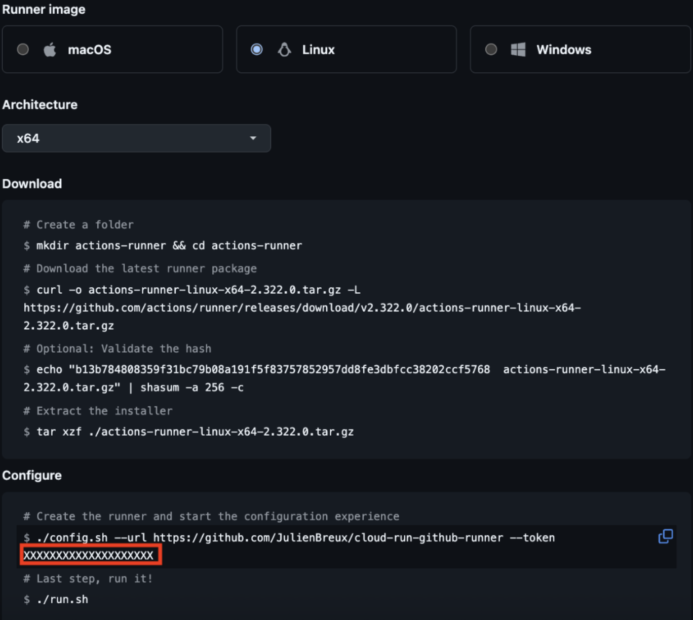
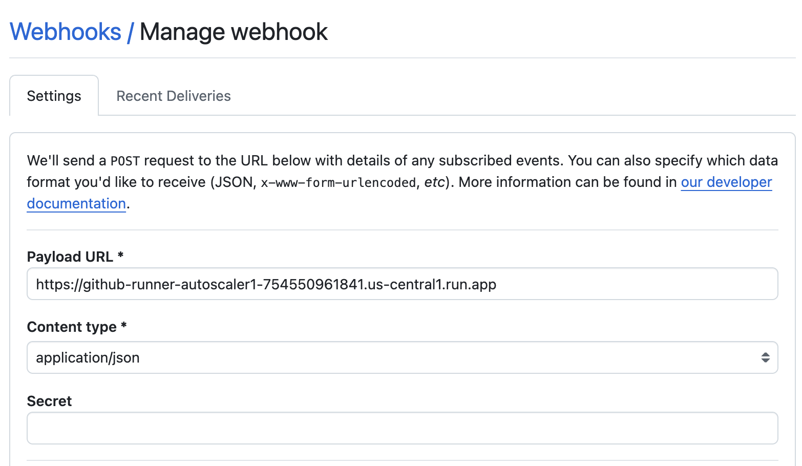

# GH Runner Worker Pools Sample

The following example walks through how to host self hosted GitHub Runner on worker pools which will execute the workflows defined in your GitHub repository. 

## About self-hosted Github runners
Runners are the machines that execute jobs in a GitHub Actions workflow. For example, a runner can clone your repository locally, install testing software, and then run commands that evaluate your code.

A self-hosted runner is a system that you deploy and manage to execute jobs from GitHub Actions on GitHub.
Self-hosted runners:
- Give you more control of hardware, operating system, and software tools than GitHub-hosted runners provide.
- Are free to use with GitHub Actions, but you are responsible for the cost of maintaining your runner machines.
- Let you create custom hardware configurations that meet your needs with processing power or memory to run larger jobs, install software available on your local network.
- Receive automatic updates for the self-hosted runner application only, though you may disable automatic updates of the runner.
- Can use cloud services or local machines that you already pay for.
- Don't need to have a clean instance for every job execution.
- Can be physical, virtual, in a container, on-premises, or in a cloud.

## Benefits of using Cloud Run Worker Pools for hosting Github runners
Cloud Run Worker Pools offer an easy way to use Cloud Run API to host runners instead of managing your VM or GKE cluster.
With fast startup and shutdown, you can configure autoscaling using Worker Pools API to execute Github actions workflow on-demand with effective compute resource utilization in response to webhook events.
With a combination of competitive pricing and scale to zero, Worker Pools offer a cost effective solution to run workflow jobs.

### Getting started
In this example, you use the following billable components of Google Cloud:
- [Artifact Registry](https://cloud.google.com/artifact-registry)
- [Cloud Build](https://cloud.google.com/cloud-build)
- [Cloud Run](https://cloud.google.com/run)
- [Secret Manager](https://cloud.google.com/security/products/secret-manager)

### Ensure you have the following IAM roles granted to your account:
- [Cloud Run Admin](https://cloud.google.com/iam/docs/roles-permissions/run#run.admin) (roles/run.admin)
- [Project IAM Admin](https://cloud.google.com/iam/docs/roles-permissions/resourcemanager#resourcemanager.projectIamAdmin) (roles/resourcemanager.projectIamAdmin)
- [Service Usage Consumer](https://cloud.google.com/iam/docs/roles-permissions/serviceusage#serviceusage.serviceUsageConsumer) (roles/serviceusage.serviceUsageConsumer)
- [Secret Manager Secret Accessor](https://cloud.google.com/iam/docs/understanding-roles#secretmanager.secretAccessor) (roles/secretmanager.secretAccessor)
- [Artifact Registry Admin](https://cloud.google.com/iam/docs/roles-permissions/artifactregistry#artifactregistry.admin) (roles/artifactregistry.admin)
- [Cloud Build Editor](https://cloud.google.com/iam/docs/roles-permissions/cloudbuild#cloudbuild.builds.editor) (roles/cloudbuild.builds.editor)

### Deploy the Runner as  Cloud Run Worker Pool deployment

Clone:

```sh
git clone https://github.com/GoogleCloudPlatform/python-docs-samples.git/
```

Create the secret:

> [!IMPORTANT]
> Change the values of `GITHUB_SECRET_VALUE`.
> See [How to get a Github register token](#how-to-get-a-github-register-token)

```sh
gcloud secrets create GH_TOKEN --replication-policy="automatic"
echo -n "GITHUB_SECRET_VALUE" | gcloud secrets versions add GH_TOKEN --data-file=-
```

Permissions:

> [!NOTE]
> Need to set the `secretAccessor` to the right service account.

```sh
gcloud secrets add-iam-policy-binding GH_TOKEN \
--member="serviceAccount:XXXX@developer.gserviceaccount.com" \
--role="roles/secretmanager.secretAccessor"
```

Deploy:

> [!IMPORTANT]
> Change the values of `GITHUB_USER_OR_ORGANIZATION` and `REPOSITORY_NAME`.

```sh
gcloud beta run worker-pools deploy cloud-run-github-runner \
--source=. \
--scaling=1 \
--set-env-vars GH_OWNER=GITHUB_USER_OR_ORGANIZATION,GH_REPOSITORY=REPOSITORY_NAME \
--set-secrets GH_TOKEN=GH_TOKEN:latest
```

> [!NOTE]
> In this case `cloud-run-github-runner` is the name of the Cloud Run Worker pool.

### How to get a Github register token

Go to "Add new self-hosted runner" in settings section of your repository.



Copy the *register token*.

## Github Runner Autoscaler

Once you deploy the worker pool with an active github runner, it's time to configure the autoscaler to provision worker instances based on the job status in the actions queue. 

You can automatically increase or decrease the number of self-hosted runners in your environment in response to the webhook events you receive with a particular label. For example, you can create automation that adds a new self-hosted runner each time you receive a [workflow_job](https://docs.github.com/en/webhooks/webhook-events-and-payloads#workflow_job) webhook event with the [queued](https://docs.github.com/en/webhooks-and-events/webhooks/webhook-events-and-payloads#workflow_job) activity, which notifies you that a new job is ready for processing. The webhook payload includes label data, so you can identify the type of runner the job is requesting. Once the job has finished, you can then create automation that removes the runner in response to the workflow_job [completed](https://docs.github.com/en/webhooks-and-events/webhooks/webhook-events-and-payloads#workflow_job) activity.

### Deploy the function to receive webhook requests

```sh

cd github-runner-autoscaler 

gcloud run deploy github-runner-autoscaler --function github_webhook_handler --region us-central1 --source . --set-env-vars GITHUB_ORG_OR_REPO='OWNER/REPO-NAME',RUNNER_SCOPE='repo',MAX_RUNNERS=5,GCP_PROJECT='PROJECT',CLOUD_RUN_WORKER_POOL_NAME='CLOUD_RUN_WORKER_POOL_NAME'
```
> [!NOTE]
> In this case `CLOUD_RUN_WORKER_POOL_NAME` is the name of the Cloud Run Worker pool you wish to autoscale.

## Configure the webhook

Under your repository, go to Settings -> Webhooks -> Manage webhook to configure the functions endpoint as the payload URL. Select Push events to trigger the webhook


