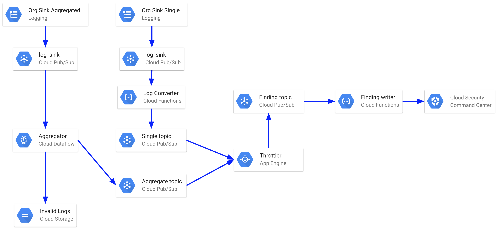

% SCC Tools: **Audit Logs Findings**
% Security Cloud Command Center Tools

\setcounter{section}{0}
\setcounter{secnumdepth}{10}
\newpage

# Introduction

_Estimated time to complete the installation: **15 minutes**_

The objective of this application is to ingest Google Audit Logs into Google Security Command Center as [findings](https://cloud.google.com/security-command-center/docs/reference/rest/v1alpha3/organizations.findings/create#sourcefinding).

The **figure \ref{fig:scc-logs-detailed}** shows a high-level overview diagram of the **SCC Audit Logs** app.

{#fig:scc-logs-detailed}

There are two types of logs created by **SCC Audit Logs** based on log filters listed below: `single`, which creates a SCC entry for each occurrence found and `aggregated`, that groups the findings within a Dataflow window period and then creates on SCC:

* Single:
  * Google Kubernetes Engine Binary Authorization
  * Google Compute Engine - GCE
  * Google Compute Storage - GCS
  * Google Networking
* Aggregated:
  * Google IAM

## Requirements \label{sec:requirements}

**ATTENTION:** Make sure you've gone through the section _'How to install the tools'_ in the main _README-${version}.pdf_ file delivered in this package. It contains **important pre-requisites and pre-installation instructions you must do** to proceed to the installation of this tool.

You will need to create a new Project and link an active _Google Cloud Billing Account_ to it to install **SCC Audit Logs**. If you do not have the permissions to create Projects or Enable Billing, **you must look for help from someone in your Organization** who has the permissions to create Projects and enable Billing on that Project.

Also, two SCC _Source ID_ numbers are required during this installation process. The section **\ref{sec:source_id}** explains how to obtain these numbers.

There are two ways of installing the tool, using **gcloud commands** or **Deployment Manager**. You will need the following IAM roles to install with **gcloud commands**:

* **Project Level**
  * Viewer - `roles/viewer`
  * App Engine Admin - `roles/appengine.appAdmin`
  * Cloud Functions Developer - `roles/cloudfunctions.developer`
  * Cloud Scheduler Admin - `roles/cloudscheduler.admin`
  * Data Flow Admin - `roles/dataflow.admin`
  * Service Account Admin - `roles/iam.serviceAccountAdmin`
  * Service Account Key Admin - `roles/iam.serviceAccountKeyAdmin`
  * Service Account User - `roles/iam.serviceAccountUser`
  * API Keys Admin - `roles/serviceusage.apiKeysAdmin`
  * Pub/Sub Admin - `roles/pubsub.admin`
  * Project IAM Admin - `roles/resourcemanager.projectIamAdmin`
  * Service Usage Admin - `roles/serviceusage.serviceUsageAdmin`
  * Storage Admin - `roles/storage.admin`
  * Storage Object Admin - `roles/storage.objectAdmin`
* **Organization Level**
  * Logging Admin - `roles/loggingAdmin`

Or, in case you choose to install with the **Deployment Manager**, you will need these roles:

* **Project Level**
  * App Engine Admin - `roles/appengine.appAdmin`
  * Cloud Scheduler Admin - `roles/cloudscheduler.admin`
  * Data Flow Admin - `roles/dataflow.admin`
  * Deployment Manager Editor - `roles/deploymentmanager.editor`
  * Service Account Admin - `roles/iam.serviceAccountAdmin`
  * Service Account Key Admin - `roles/iam.serviceAccountKeyAdmin`
  * Project IAM Admin - `roles/resourcemanager.projectIamAdmin`
  * API Keys Admin - `roles/serviceusage.apiKeysAdmin`
  * Service Usage Admin - `roles/serviceusage.serviceUsageAdmin`
  * Storage Admin - `roles/storage.admin`
  * Storage Object Admin - `roles/storage.objectAdmin`

_Note: If you are the Project Owner or Editor you already have the Project Level roles._

You will also need someone with Organization Administrator role to give the permissions listed below to the following service accounts:

* SCC Finding Editor Service Account (details in **section \ref{sec:scc_client_sa}**)
  * Security Center Findings Editor - `roles/securitycenter.findingsEditor`
  * Security Center Sources Editor - `roles/securitycenter.sourceEditor`
* SCC Project Browser Service Account  (details in **section \ref{project_browser_sa}**)
  * Browser - `roles/browser`
  

# Install the **SCC Audit Logs** application

## Step 1: Creating the Project

First, create the Project in which the **SCC Audit Logs** application will be installed using the command below:

```bash
# the organization id where the project should be created
export organization_id=<your_org_id>

# project id to be created
export scc_audit_logs_project_id=<your_scc_audit_logs_project_id>

# create the project
gcloud projects create ${scc_audit_logs_project_id} --organization ${organization_id}
```

## Step 2: Linking the Project to a Billing Account

The Project in which **SCC Audit Logs** will be installed needs to have a linked _Billing Account_.

Usually you should ask your _Billing Administrator_ to link a valid Billing Account in your Project. However, if you have the permission to link Billing Accounts to a Project, you can use the commands below to accomplish this task.

_Note: If you want, you can learn more about 'Modifying a Project's Billing Settings' by following [this link](https://cloud.google.com/billing/docs/how-to/modify-project)._

```bash
# the project created to install the application
export scc_audit_logs_project_id=<your_scc_audit_logs_project_id>

# a valid billing Account ID to be linked to the
# project (ask your Billing Administrator which one to use)
# [Billing accounts](https://console.cloud.google.com/billing)
export billing=<your_billing_account_id>

# link billing account
gcloud beta billing projects link ${scc_audit_logs_project_id} --billing-account ${billing}
```

_Note: If the above command fail, ask your _Billing Administrator_ for help._

## Step 3: Enabling Google API's

The **SCC Audit Logs** application needs some Google APIs enabled in the Project.

Use the gcloud commands below to enable the necessary APIs:

```bash
# the project created to install the application
export scc_audit_logs_project_id=<your_scc_audit_logs_project_id>

# enable APIs
gcloud services enable \
  cloudbuild.googleapis.com \
  cloudfunctions.googleapis.com \
  cloudresourcemanager.googleapis.com \
  compute.googleapis.com \
  datastore.googleapis.com \
  logging.googleapis.com \
  monitoring.googleapis.com \
  pubsub.googleapis.com \
  storage-component.googleapis.com \
  dataflow.googleapis.com \
  securitycenter.googleapis.com \
  --project ${scc_audit_logs_project_id}
```

## Step 4: Create SCC Client Finding Editor Service Account \label{sec:scc_client_sa}

To create the SCC Client Service Account the user must have the following IAM roles:

* Organization Administrator - `roles/resourcemanager.organizationAdmin`
* Security Center Admin - `roles/securitycenter.admin`
* Service Account Admin -  `roles/iam.serviceAccountAdmin`
* Service Account Key Admin - `roles/iam.serviceAccountKeyAdmin`

_Note: If the user does not have these roles, ask for help from someone from your organization to execute the instructions in this section._

These roles are necessary to grant the following roles to the service account:

* **Organization Level**
  * Security Center Findings Editor - `roles/securitycenter.findingsEditor`
  * Security Center Sources Editor - `roles/securitycenter.sourceEditor`

Create environment variables:

```bash
# set the organization id (to get your organization ID, please follow the link below)
# https://cloud.google.com/resource-manager/docs/creating-managing-organization
export organization_id=<your_organization_id>

# the project created to install the application
export scc_audit_logs_project_id=<your_scc_audit_logs_project_id>

# the project ID where the service account will be created
export scc_api_project_id=${scc_audit_logs_project_id}

# the working directory.
export working_dir=${HOME}/scc-tools-install

# enter the installation working directory
cd ${working_dir}
```

Run these commands to create the service account:

```bash
# Create the Service Account
gcloud iam service-accounts create scc-finding-editor  \
 --display-name "SCC Finding Editor SA"  \
 --project ${scc_api_project_id}


# Download the service account key file
(cd setup; \
 gcloud iam service-accounts keys create \
 service_accounts/scc-finding-editor-${scc_api_project_id}-service-account.json \
 --iam-account scc-finding-editor@${scc_api_project_id}.iam.gserviceaccount.com)
```

You need an user with Organization Administrator role to give the organization level roles. If you are not an Organization Administrator
please contact someone on you organization with required permissions to execute below commands.

```bash
# Grant the Organization Level roles
gcloud beta organizations add-iam-policy-binding ${organization_id} \
 --member="serviceAccount:scc-finding-editor@${scc_api_project_id}.iam.gserviceaccount.com" \
 --role='roles/securitycenter.findingsEditor'

 gcloud beta organizations add-iam-policy-binding ${organization_id} \
 --member="serviceAccount:scc-finding-editor@${scc_api_project_id}.iam.gserviceaccount.com" \
 --role='roles/securitycenter.sourcesEditor'
```

If you already have that service account created and only need to download another key file, you can just run the following command:

_Note: If you are installing the SCC Tools in a new version of SCC API (e.g. from Alpha to Beta), do **not** use the same Service Account. You must create a new Service Account for the new version of the API._

```bash
(cd setup; \
export service_account_email=scc-finding-editor@${scc_api_project_id}.iam.gserviceaccount.com; \
export output_file=service_accounts/scc-finding-editor-${scc_api_project_id}-service-account.json; \
gcloud iam service-accounts keys create ${output_file} --iam-account=${service_account_email})
```

## Step 5: Turning on Google App Engine

The **SCC Audit Logs** application uses Google App Engine (GAE) as its execution environment. You need someone with the **Project Owner** role to turn GAE on before installing the application. If you do not have this role, you must look for help from someone in your Organization who has it to turn GAE on in your project with the following commands.

```bash
# the project created to install the application
export scc_audit_logs_project_id=<your_scc_audit_logs_project_id>

# one region listed in
# [App Engine Regions](https://cloud.google.com/appengine/docs/locations)
export gae_region=<your-gae-region>

# create GAE
gcloud app create \
 --region ${gae_region} \
 --project ${scc_audit_logs_project_id}
```

**Note:** _You **cannot change** a Google App Engine's region **after** you set it._

## Step 6: Grant role to _Cloud Services_ service account

If you are using Deployment Manager to deploy the application you have to grant the role **Logging Admin** in **Organization Level** to the generated service account, otherwise you can skip to **\ref{sec:project_browser_sa}**

To do this, run the following command to get the service account name so you can grant the above mentioned role:

```bash
# the project created to install the application
export scc_audit_logs_project_id=<your_scc_audit_logs_project_id>

# get the service account name
gcloud projects describe ${scc_audit_logs_project_id} | \
  grep projectNumber: | \
  sed s/"projectNumber: '"//g | \
  sed s/"'"/@cloudservices.gserviceaccount.com/g
```

## Step 7: Creating the _Organization Projects Browser_ service account \label{sec:project_browser_sa}

The **SCC Audit Logs** application uses a service account to check projects in organization to translate Project ID in Project Number.

Execute the commands below to create the service account.

```bash
# the project created to install the application
export scc_audit_logs_project_id=<you-scc-logs-project-id>

# the working directory.
export working_dir=${HOME}/scc-tools-install

# enter the installation working directory
cd ${working_dir}

# Create the Service Account
gcloud iam service-accounts create projects-browser  \
 --display-name "Projects Browser SA"  \
 --project ${scc_audit_logs_project_id}

# Download the service account key file
(cd setup; \
 gcloud iam service-accounts keys create \
 service_accounts/projects-browser-${scc_audit_logs_project_id}-service-account.json \
 --iam-account projects-browser@${scc_audit_logs_project_id}.iam.gserviceaccount.com)
```

You need an user with Organization Administrator role to give the organization level role. If you are not an Organization Administrator
please contact someone on you organization with required permissions to execute below commands.

```bash
# Grant the Organization Level roles
gcloud beta organizations add-iam-policy-binding ${organization_id} \
 --member="serviceAccount:projects-browser@${scc_audit_logs_project_id}.iam.gserviceaccount.com" \
 --role='roles/browser'
```

## Step 8: Creating the SCC API Key

The **SCC Audit Logs** application needs an API Key to call the SCC APIs. Follow these steps to create this key:

1. Go to `https://console.cloud.google.com/apis/credentials` in your **SCC Audit Logs** Project.
2. Click on `Create Credentials` and choose `API key`.
3. Copy the generated API key value. You will be asked for this value in the next sections.

## Step 9: Obtaining SCC Source IDs \label{sec:source_id}

**SCC Audit Logs** , on top of having single and aggregate findings, also have two types of findings based on the source type: _Audit log Findings_ and _Binary Authorization Findings_. Each one will need a different SCC _Source_ to identify to which case it belongs.

**SCC Audit Logs** needs the SCC _Sources_ to exist in order to write Findings in SCC.

If you have already created _Sources_ for **SCC Audit Logs** and **SCC Binary Authorization** before, use the following commands to find the correct _Source IDs_ numbers for both:

```bash
export organization_id=<your-organization-id>
export scc_audit_logs_project_id=<your_scc_audit_logs_project_id>
export scc_api_project_id=${scc_audit_logs_project_id}

export scc_sa_file=setup/service_accounts/scc-finding-editor-${scc_api_project_id}-service-account.json;
export url=https://securitycenter.googleapis.com/v1beta1/organizations/${organization_id}/sources?pageSize=100

gcloud auth activate-service-account --key-file=${scc_sa_file}

export access_token=$(gcloud auth print-access-token)

curl -H "Authorization: OAuth ${access_token}" ${url}
```

_Note: Remember to change the activated service account back to your user when you finish._

If you have never created _Sources_ for **SCC Audit Logs** and **SCC Binary Authorization** before, you need to create them now. Use the following commands to create an SCC _Source_:

```bash
export organization_id=<your-organization-id>
export scc_audit_logs_project_id=<your_scc_audit_logs_project_id>
export scc_api_project_id=${scc_audit_logs_project_id}

export scc_sa_file=setup/service_accounts/scc-finding-editor-${scc_api_project_id}-service-account.json;
export url="https://securitycenter.googleapis.com/v1beta1/organizations/${organization_id}/sources"

gcloud auth activate-service-account --key-file=${scc_sa_file}

export access_token=$(gcloud auth print-access-token)

export data="{display_name: 'Audit Logs', description: 'Audit Logs'}"

curl -H "Authorization: OAuth ${access_token}" \
  -H "Content-Type: application/json" \
  --request POST \
  --data "${data}" \
  ${url}

export data="{display_name: 'Binary Authorization', description: 'Binary Authorization'}"

curl -H "Authorization: OAuth ${access_token}" \
  -H "Content-Type: application/json" \
  --request POST \
  --data "${data}" \
  ${url}

```

_Note: Remember to change the activated service account back to your user when you finish._

Example of an SCC Source object as returned by the API:

```json
{
  "name": "organizations/<your-organization-id>/sources/<the-scc-source-id>",
  "displayName": "Audit Logs",
  "description": "Audit Logs"
}

Take note of the number in **<the-scc-source-id>** part for both Audit Logs and Binary Authorization. You'll use them in the next steps.

```

## Step 10: Deploy the SCC Audit Logs application

Open **Google Cloud Shell** and upload the following file to your `${HOME}` directory:

* scc-audit-logs-${version}.zip

Set the environment variables required by the installation scripts.

**Note:** _You must set them with values that are valid in your context, editing the snippet below before running the commands._

```bash
# the scc tools release version you received.
export version=<release_version>

# directory to unzip the installation zip files.
export working_dir=${HOME}/scc-tools-install

# the organization id where these scripts will run
export organization_id=<your-org-id>

# the actual project that will have the Security Command Center Audit Logs integration Application
export scc_audit_logs_project_id=<you-scc-logs-project-id>

# one region from the link below for REGIONAL bucket
# [Google storage bucket locations](https://cloud.google.com/storage/docs/bucket-locations)
export bucket_region=<your-cloud-function-bucket_region>

# API Key to access SCC API from your SCC enabled project
# [Google Credentials](https://console.cloud.google.com/apis/credentials)
export scc_api_key=<your-scc-api_key>

# Absolute path to the Service Account file for the Security Command Center API Project
export scc_sa_file=<absolute_path_to_service_account_file>

# Absolute path to the Service Account file for organization wide project browser role.
export org_browser_sa_file=<absolute_path_to_service_account_file>

# SCC Source ID (only the number) to create the findings for audit logs.
export scc_audit_log_source_id=<scc_audit_log_source_id>

# SCC Source ID (only the number) to create the findings for Binary Authorization.
export scc_binary_authorization_source_id=<scc_binary_authorization_source_id>


```

Unzip the uploaded file and enter the working directory:

```bash
# unzip the uploaded files to a work directory
unzip -qo scc-audit-logs-${version}.zip -d ${working_dir}

# enter the installation working directory
cd ${working_dir}
```

There are two options to deploy the application using the script *run_setup.py*: using **gcloud commands** or the **Deployment Manager**. If you choose to use the Deployment Manager, add the flag `--use_dm` or leave the python command as it is to run the default option with the gcloud commands.

Now run the following command to create the remaining infrastructure, the Pub/Sub topics, and deploy the application:

**Note:** _If you want to just see a simulation of the execution of the following command (a dry run), use the option `--simulation`._

**Note:** _The default Dataflow time window set for this app is 60 minutes, if you want to change this value use the option `--df_window` followed by desired value in minutes._

```bash
(cd scc-logs/setup; \
pipenv --python 3.5.3; \
pipenv install --ignore-pipfile; \
pipenv run python3 run_setup.py \
  --organization_id ${organization_id} \
  --project ${scc_audit_logs_project_id} \
  --bucket_region ${bucket_region} \
  --scc_api_key ${scc_api_key} \
  --scc_sa_file ${scc_sa_file} \
  --org_browser_sa_file ${org_browser_sa_file} \
  --audit_logs_source_id ${scc_audit_log_source_id} \
  --binary_authorization_source_id ${scc_binary_authorization_source_id} \
  --no-simulation)
```

**Note:** _When running the previous script in simulation mode you may see a `BucketNotFoundException: 404` that could mislead you to think that something went wrong. It is an expected scenario and the bucket will be created when running in non simulation mode._

**Note:** _It can take approximately 5 minutes for a log entry to be added as finding into SCC. Refer to **User Guide** for more details._