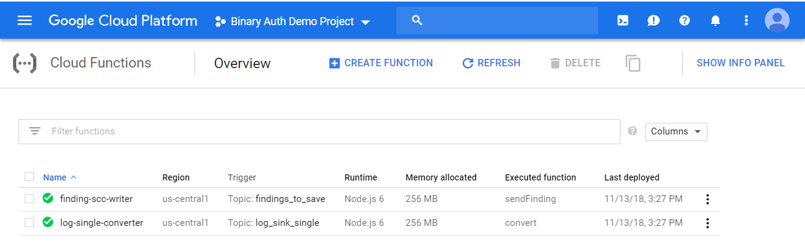
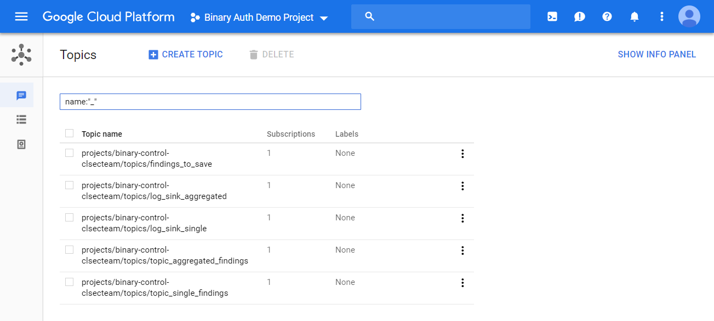
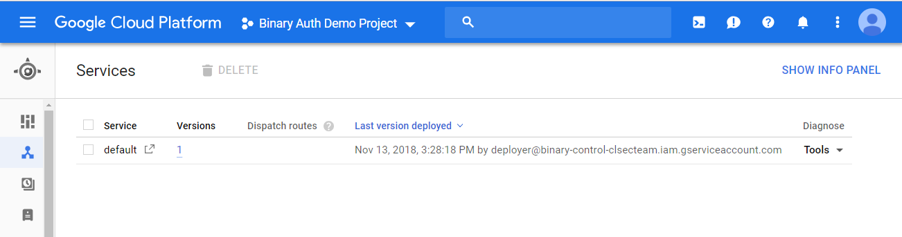
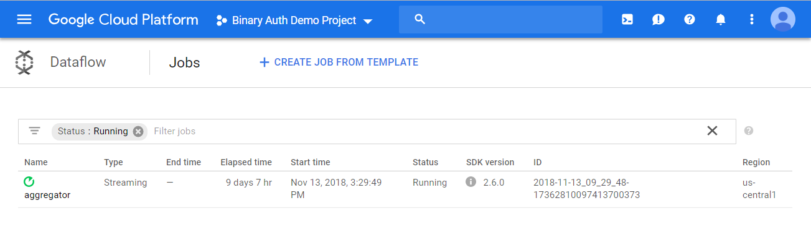
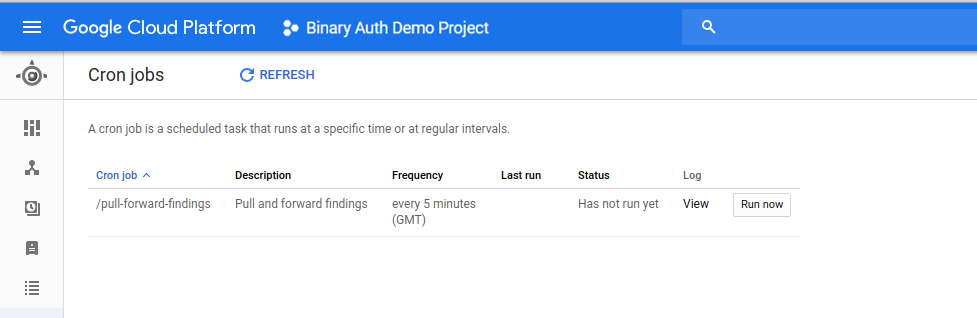

% SCC Tools: **Audit Logs Findings** User Guide
% Security Cloud Command Center Tools

\setcounter{section}{0}
\setcounter{secnumdepth}{10}
\newpage

# Verify the installation

Go to the Cloud Functions page and see the cloud functions deployed (Figure \ref{fig:cloud_functions_list}).

{#fig:cloud_functions_list width=50% height=25%}

Go to Pub/Sub page on the console and see the topics created (Figure \ref{fig:topics_page}).

{#fig:topics_page width=50% height=25%}

Go to App Engine Services page on the console and see the App Engine Service created (Figure \ref{fig:gae}).

{#fig:gae width=50% height=25%}

Go to Dataflow page on the console and see the Dataflow Pipeline created (Figure \ref{fig:dataflow}).

{#fig:dataflow width=50% height=25%}

To check if sinks were created, you can run the following script.

Check logged user, the user must have _Logging Administrator on *Organization Level*_:

```bash
gcloud auth list
```

If the active user is not yours, change it to your user using the instructions at the end of the command result and then check sinks. The following command will print the sinks in the organization, you can verify if their destinations is the topic from your project.

```bash
gcloud logging sinks list --organization=${organization_id}
```

If you which to change the sink destination, you can run the following command:

```bash
# the name of the sink you which to change the destination
export sink_name=<sink_to_change>

# the full path of the topic in your project you which the sink sends its messages to
# ie.: pubsub.googleapis.com/projects/<project_name>/topics/<topic_name>
export destination_topic=<destination_topic_for_the_sink>

# update the sink destination
gcloud logging sinks update ${sink_name} ${destination_topic} --organization ${organization_id}
```

# How to use

With everything up and running, every entry found that matches the configured sink filter will create a single or an aggregated finding in SCC.

You can check and alter the configured filters with the list and update commands in the section above, and depending on the configured destination, the findings will be sent to SCC one by one (e.g. creating a bucket) or aggregated (e.g. changing IAM rules).

## Single workflow

1. Create a bucket
2. The single sink with the filter that matches this change will publish a message in the destination topic
3. The Cloud Function log-single-converter will read that message and convert it to a value that the SCC understands
    1. After converting the message, it will be published to another topic
4. Periodically (every 5 minutes by default), GAE will run and fetch the messages from that topic and call the finding-scc-writer Cloud Function
    1. The function will publish the message to SCC
    2. The GAE application is throttling the messages to not overload the SCC API (10 messages per second by default)

## Aggregated workflow

1. Add a IAM rule, save it, then remove another and add a different one, then save it
2. The aggregated sink with the filter that matches this change will publish a message in the destination topic
3. Perfiodically (every 60 minutes by default) the Dataflow will run and group the messages from the topic and send them to SCC

# Cleanup and Restore Audit Logs Flow

The following script will help you to avoid be charged by the created resources, or to restore a previous running environment by:

* Delete/Recreate PubSub Subscriptions
* Delete/Recreate Cloud Functions
* Cancel/Recreate Dataflow Jobs

The script can be used in two different ways, to cleanup or restore the Audit Logs flow.
Each one of these ways will be exemplified following this document.

_Note: To execute the following scripts you will need the same roles described on section **Requirements** of the README document._

Set the environment variables required by the installation scripts.

```bash
# id of the project hosting scc audit logs application
export scc_logs_project_id=<your_scc_audit_logs_project_id>

# the organization id where these scripts will run
export organization_id=<your-org-id>

# one region from the link below for REGIONAL bucket
# [Google storage bucket locations](https://cloud.google.com/storage/docs/bucket-locations)
export bucket_region=<your-cloud-function-bucket_region>

# API Key to access SCC API from your SCC enabled project
# [Google Credentials](https://console.cloud.google.com/apis/credentials)
export scc_api_key=<your-scc-api_key>

# Absolute path to the Service Account file for the Security Command Center API Project
export scc_sa_file=<absolute_path_to_service_account_file>

# Absolute path to the Service Account file for organization wide project browser role.
export org_browser_sa_file=<absolute_path_to_service_account_file>

# source ID to create the findings from
export audit_logs_source_id=<source_id-from-findings>
```

Executing Audit Logs **Cleanup** flow:

```bash
(cd scc-logs/setup; \
pipenv run python3 run_audit_logs_cleanup.py cleanup_chain \
  --project ${scc_logs_project_id} --no-simulation)
```

Executing Audit Logs **Restore** flow:

```bash
(cd scc-logs/setup; \
pipenv run python3 run_audit_logs_cleanup.py restore_chain \
  --organization_id ${organization_id} \
  --project ${scc_logs_project_id} \
  --bucket_region ${bucket_region} \
  --scc_api_key ${scc_api_key} \
  --scc_sa_file ${scc_sa_file} \
  --org_browser_sa_file ${org_browser_sa_file} \
  --audit_logs_source_id ${audit_logs_source_id} \
  --no-simulation)
```

# Change SCC Finding creation flow

The **Throttler** component is a Google App Engine application that controls the finding creation flow on SCC from both _single_ and _aggregated_ audit logs. The default frequency set for it is 5 minutes.
To change this value you can alter the _schedule_ parameter following this [documentation](https://cloud.google.com/appengine/docs/standard/python/config/cronref#schedule_format) on file **throttler/cron.yaml** that contains the content below:

```yaml
cron:
- description: "Pull and forward findings"
  url: /pull-forward-findings
  target: default
  schedule: every 5 minutes
```

To apply the change you can execute the command below:

```bash
# id of the project hosting scc audit logs application
export scc_logs_project_id=<your_scc_audit_logs_project_id>

(cd scc-logs/throttler; \
gcloud app deploy cron.yaml --quiet --project ${scc_logs_project_id})
```

If you desire to force the **Throttler** execution, you can access the URL generated by the command below and clicking on **Run now** as seen on the **figure \ref{fig:cron}**:

```bash
# id of the project hosting scc audit logs application
export scc_logs_project_id=<your_scc_audit_logs_project_id>

# the organization id
export organization_id=<your-org-id>

# cron jobs base url
export base_url=https://console.cloud.google.com/appengine/cronjobs

# prints the throttler cron overview url
echo "${base_url}?organizationId=${organization_id}&project=${scc_logs_project_id}"
```

{#fig:cron width=50% height=25%}
