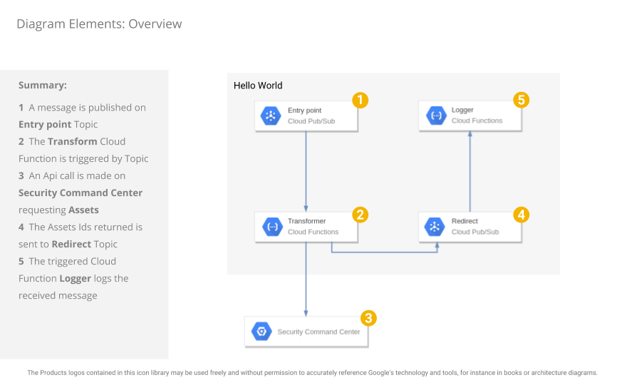
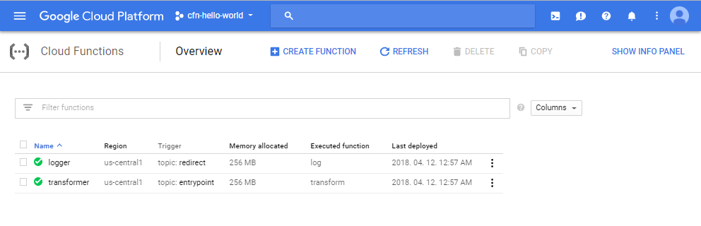
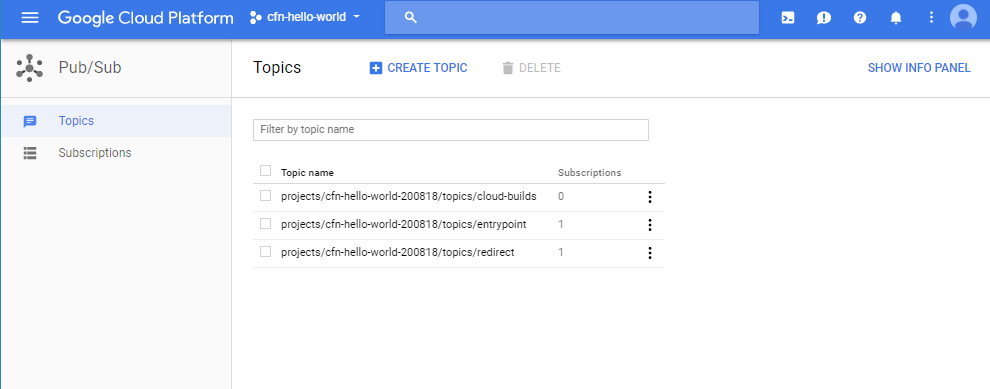
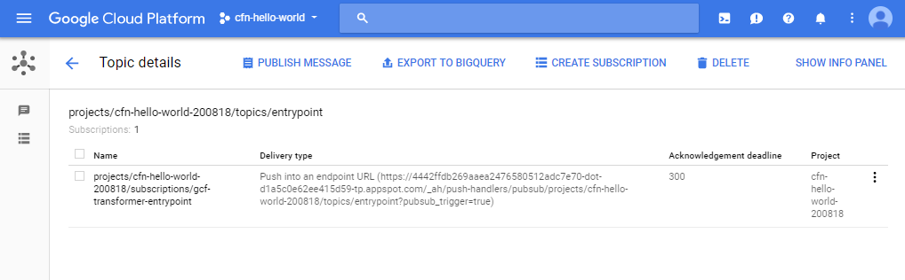
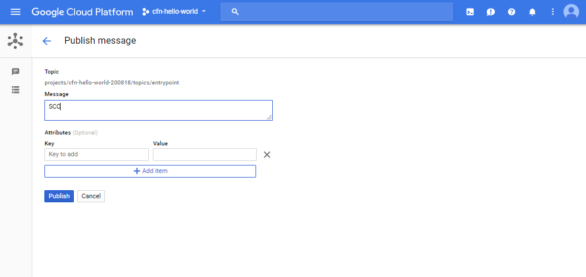
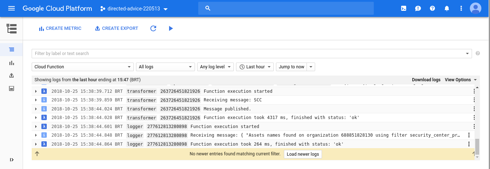

% SCC Tools: **Hello World**
% Security Cloud Command Center Tools

\setcounter{section}{0}
\setcounter{secnumdepth}{10}
\newpage

# Introduction

_Estimated time to complete the installation: **15 minutes**_

This application is a minimal example of how to call Security Command Center (SCC) API's and process the results.

The **figure \ref{fig:hello-world-detailed}** shows a high-level overview diagram of the **HelloWorld** app.

{#fig:hello-world-detailed}

The app searches for all _Assets_ that SCC has found in your Organization and prints their ID's in the logs. This process is started when a message is published to the `Entrypoint` Pub/Sub topic.

The code in **Hello World** application can be used as a starting point to implement other behaviors. For example, you could do the following changes:

* Execute a different query on SCC (e.g. search for _Findings_ with specific characteristics) by changing the `Transformer` function.
* Store the result of a query in a database (or send it to another system as a notification) by changing the `Logger` function.

## Requirements \label{sec:requirements}

**_ATTENTION:_** Before start, make sure you've gone through the section **'How to install the tools'** in the main  **`README-${version}.pdf`** file delivered in this package. It contains **important pre-requisites and pre-installation instructions you must do** to proceed to the installation of this tool.

You will need to have a new Project created and linked to an active _Google Cloud Billing Account_ to install **Hello World**. If you do not have the permissions to create Projects or Enable Billing, **you must look for help from someone in your Organization** who has the permissions to create Projects and enable Billing on that Project.

If you can create the **Hello World** Project you will be the _Project Owner_ and have all the necessary permissions to run the installation, deploy and use the application.

If you can't create the Project, your administrator will need to give you the **Owner** or **Editor** Cloud IAM roles, or at least the following roles in your **Hello World** Project:

* Viewer - `roles/viewer`
* Service Usage Admin - `roles/serviceusage.serviceUsageAdmin`
* API Keys Admin - `roles/serviceusage.apiKeysAdmin`
* Compute Storage Admin - `roles/storage.admin`
* Storage Admin - `roles/storage.admin`
* Storage Object Admin - `roles/storage.objectAdmin`
* Pub/Sub Admin - `roles/pubsub.admin`
* Cloud Functions Developer - `roles/cloudfunctions.developer`
* Service Account User - `roles/iam.serviceAccountUser`

_Note: If your user is not the **Project Owner** or don't have all of the required IAM roles, ask someone on your Organization to assign those roles to your user so you can continue with the installation process._

You will also need someone with Organization Administrator role to give the permissions listed below to the SCC Client Service Account (detailed in **section \ref{sec:scc_client_sa}**)

* Security Center Assets Viewer - `roles/securitycenter.assetsViewer`

# Install the **Hello World** application

## Step 1: Create the Project

Create the Project in which the **Hello World** application will be installed. You can use the command below to accomplish this.

```bash
# the organization id where the project should be created
export organization_id=<your_org_id>

# project id to be created
export hello_world_project_id=<your_hello_world_project_id>

gcloud projects create ${hello_world_project_id} \
  --organization ${organization_id}
```

## Step 2: Link the Project to a Billing Account

The Project in which **Hello World** will be installed needs to have a linked _Billing Account_.

Usually you should ask your _Billing Administrator_ to link a valid Billing Account in your Project. However, if you have the permission to link Billing Accounts to a Project, you can use the commands below to accomplish this task.

_Note: If you want, you can learn more about 'Modifying a Project's Billing Settings' by following [this link](https://cloud.google.com/billing/docs/how-to/modify-project)._

```bash
# the project created to install the application
export hello_world_project_id=<your_hello_world_project_id>

# a valid billing Account ID to be linked to the
# project (ask your Billing Administrator which one to use)
# [Billing accounts](https://console.cloud.google.com/billing)
export billing=<your_billing_account_id>

gcloud beta billing projects link ${hello_world_project_id} \
  --billing-account ${billing}
```

_Note: If the above command fail, ask your _Billing Administrator_ for help._

## Step 3: Enable API's

The **Hello World** application needs some Google APIs enabled in the Project.

Use the commands below to enable the necessary APIs:

```bash
# the project created to install the application
export hello_world_project_id=<your_hello_world_project_id>

gcloud services enable \
  securitycenter.googleapis.com \
  servicemanagement.googleapis.com \
  cloudresourcemanager.googleapis.com \
  cloudfunctions.googleapis.com \
  --project ${hello_world_project_id}
```

## Step 4: Create SCC Client Service Account \label{sec:scc_client_sa}

To create the SCC Client Service Account the user must have the following IAM roles:

* Organization Administrator - `roles/resourcemanager.organizationAdmin`
* Security Center Admin - `roles/securitycenter.admin`
* Service Account Admin -  `roles/iam.serviceAccountAdmin`
* Service Account Key Admin - `roles/iam.serviceAccountKeyAdmin`

_Note: If the user does not have these roles, ask for help from someone from your organization to execute the instructions in this section_

These roles are necessary to grant the following role to the service account:

* **Organization Level**
  * Security Center Assets Viewer - `roles/securitycenter.assetsViewer`

Create environment variables:

```bash
# set the organization id (to get your organization ID, please follow the link below)
# https://cloud.google.com/resource-manager/docs/creating-managing-organization
export organization_id=<your_organization_id>

# the project created to install the application
export hello_world_project_id=<your_hello_world_project_id>

# the project ID where the service account will be created
export scc_api_project_id=${hello_world_project_id}

# the working directory.
export working_dir=${HOME}/scc-tools-install

# enter in the installation working directory
cd ${working_dir}
```

Run these commands to create the service account:

```bash
# Create the Service Account
gcloud iam service-accounts create scc-asset-viewer  \
 --display-name "SCC Asset Viewer SA"  \
 --project ${scc_api_project_id}

# Download the service account key file
(cd setup; \
 gcloud iam service-accounts keys create \
 service_accounts/scc-asset-viewer-${scc_api_project_id}-service-account.json \
 --iam-account scc-asset-viewer@${scc_api_project_id}.iam.gserviceaccount.com)
```
You need an user with Organization Administrator role to give the organization level roles. If you are not an Organization Administrator
please contact someone on you organization with required permissions to execute below commands.

```bash
# Grant the Organization Level roles
gcloud beta organizations add-iam-policy-binding ${organization_id} \
 --member="serviceAccount:scc-asset-viewer@${scc_api_project_id}.iam.gserviceaccount.com" \
 --role='roles/securitycenter.assetsViewer'
```

If you already have that service account created and only need to download another key file, you can just run the following command:

_Note: If you are installing the SCC Tools in a new version of SCC API (e.g. from Alpha to Beta), do **not** use the same Service Account. You must create a new Service Account for the new version of the API._

```bash
(cd setup; \
export service_account_email=scc-asset-viewer@${scc_api_project_id}.iam.gserviceaccount.com; \
export output_file=service_accounts/scc-asset-viewer-${scc_api_project_id}-service-account.json; \
gcloud iam service-accounts keys create ${output_file} --iam-account=${service_account_email})
```

## Step 5: Create the SCC API Key

The **Hello World** application needs an API Key to call the SCC APIs. Follow these steps to create this key:

1. Go to `https://console.cloud.google.com/apis/credentials` in your **Hello World** Project.
2. Click on `Create Credentials` and choose `API key`.
3. Copy the generated API key value. You will be asked for this value in the next sections.

## Step 6: Deploy the **Hello World** application

Open **Google Cloud Shell** and upload the following file to your `${HOME}` directory:

* scc-hello-world-${version}.zip

Set the environment variables required by the installation scripts.

**Note:** _You must set them with values that are valid in your context, editing the snippet below before running the commands._

```bash
# the scc tools release version you received.
export version=<release_version>

# directory to unzip the installation zip files.
export working_dir=${HOME}/scc-tools-install

# the organization id where these scripts will run
export organization_id=<your_org_id>

# the project created to install the application
export hello_world_project_id=<your_hello_world_project_id>

# one region listed in
# [Cloud Functions Locations](https://cloud.google.com/functions/docs/locations)
export region=<your_region>

# a bucket that is used on the cloud function deploy
# [Google storage bucket](https://cloud.google.com/storage/)
export cf_bucket_name=<your_cloud_function_bucket>

# absolute path to the Service Account file for the the Security Command Center API Project
export scc_sa_file=<absolute_path_to_scc_apiservice_account_file>

# SCC Api key to call the SCC APIs, created in previous section
export api_key=<your_scc_api_key>
```

Unzip the uploaded file and enter the working directory:

```bash
# unzip the uploaded files to a work directory
unzip -qo scc-hello-world-${version}.zip -d ${working_dir}

# enter the installation working directory
cd ${working_dir}
```

Now run the following command to create the remaining infrastructure and deploy the application:

**Note:** _If you want to just see a simulation of the execution of the following command, use the option `--simulation`._

```bash
(cd hello-world/setup; \
mkdir -p ../function/transformer/accounts; \
cp -f ${scc_sa_file} ../function/transformer/accounts/cscc_api_client.json; \
pipenv run python3 run_setup.py \
  --organization_id ${organization_id} \
  --project ${hello_world_project_id} \
  --region ${region} \
  --api_key ${api_key} \
  --no-simulation)
```

# Using the **Hello World** application

You can go to the Cloud Functions page (figure \ref{fig:cloud_functions_list}) and see the functions deployed.

{#fig:cloud_functions_list}

You can also see the Pub/Sub topics created in the installation by going to the Pub/Sub page (figure \ref{fig:topics}) on the Google Cloud Console.

{#fig:topics}

Now, post a message with any content to the Pub/Sub topic named `Entrypoint` (figure \ref{fig:entrypoint} and \ref{fig:anymessage}).

{#fig:entrypoint}

{#fig:anymessage}

Verify the logs (figure \ref{fig:results}) to see the results of the execution of the Cloud Functions. You should see a list of _Asset_ names for your Organization.

{#fig:results}
