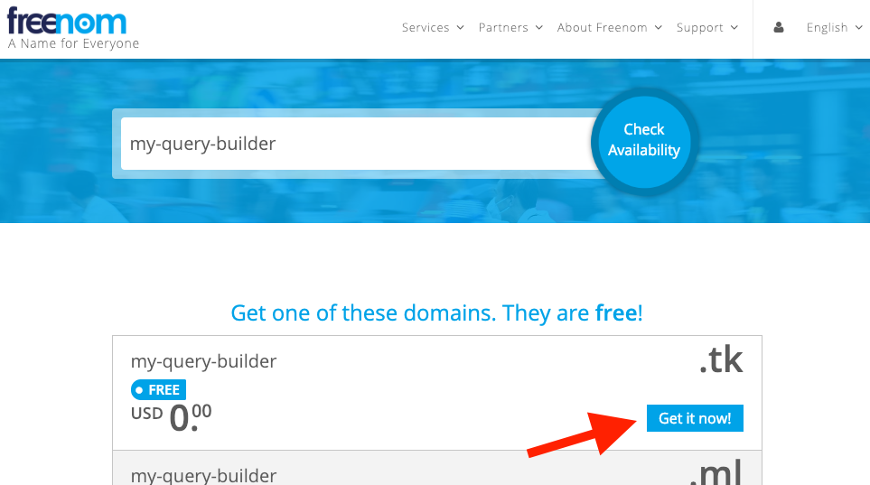
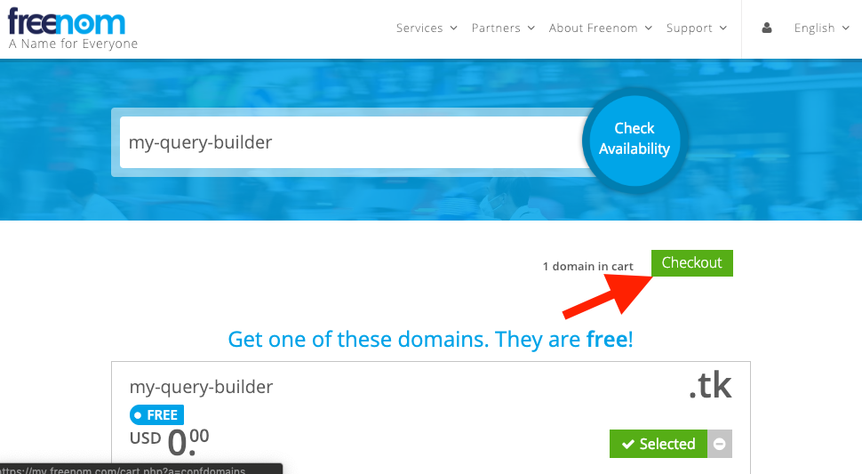
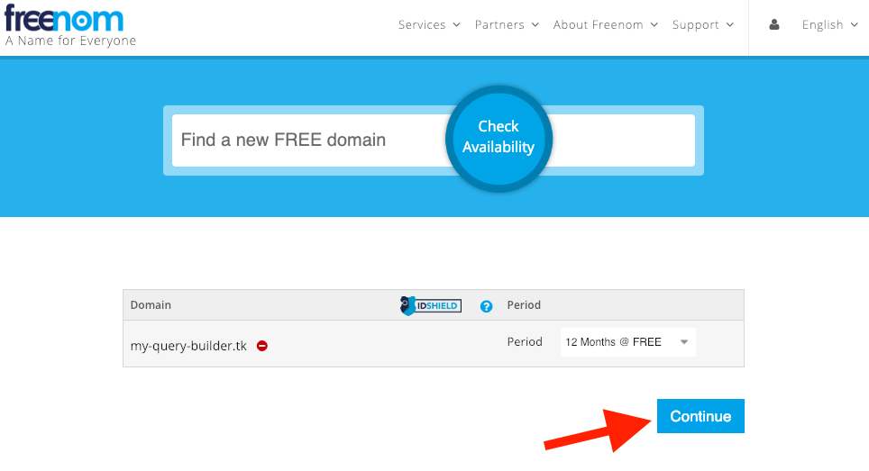
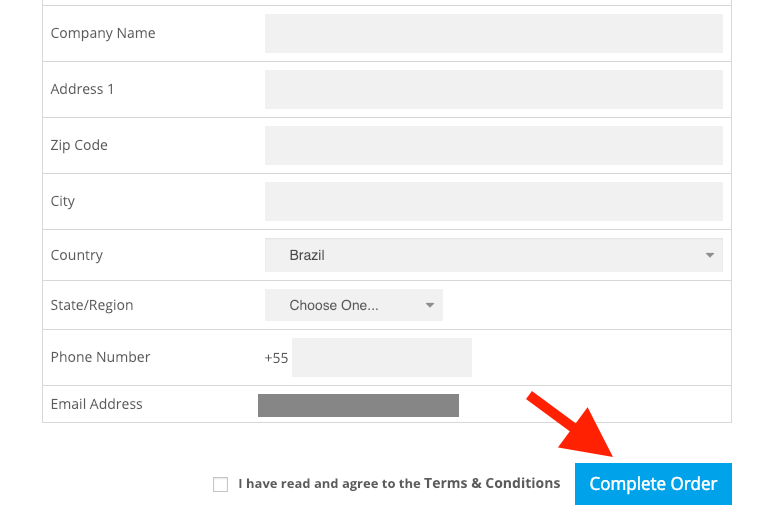
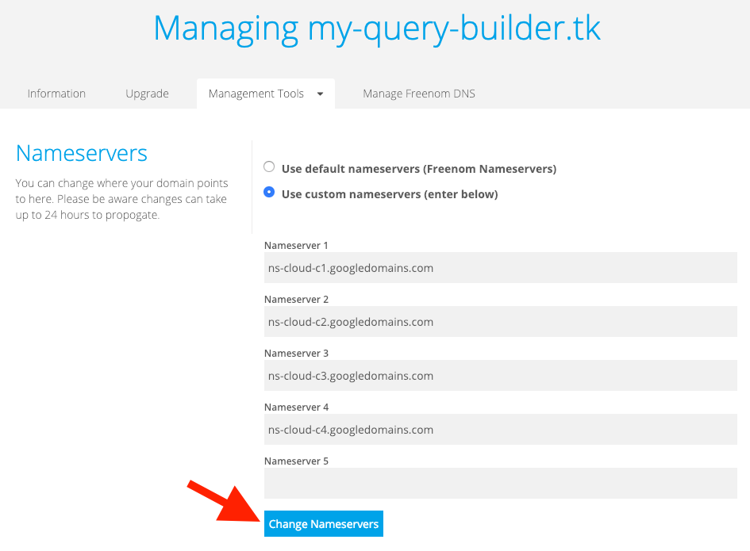

% SCC Tools: **Query Builder**
% Security Cloud Command Center Tools

\setcounter{section}{0}
\setcounter{secnumdepth}{10}

# Introduction

_Estimated time to complete the installation: **2 hours**_

**Query Builder** is an application you can use to create and schedule advanced _multi-step_ queries on **SCC** data using a web application interface. When these queries run, the results may be sent to a **Pub/Sub** topic for the consumption of other systems and also have security marks added to them on **SCC**.

As an example, you could schedule a query to periodically look for network firewalls with port 22 allowed, have the results marked in **SCC** and notify your security team so they can take appropriate action.

## Requirements \label{sec:requirements}

**ATTENTION:** Make sure you've gone through the section _'How to install the tools'_ in the main _README-${version}.pdf_ file delivered in this package. It contains **important pre-requisites and pre-installation instructions you must do** to proceed to the installation of this tool.

You will need to create a new Project and link an active _Google Cloud Billing Account_ to it to install **Query Builder**. If you do not have the permissions to create Projects or Enable Billing, **you must look for help from someone in your Organization** who has the permissions to create Projects and enable Billing on that Project.

There are two ways of installing the tool, using **gcloud commands** or **Deployment Manager**. You will need the following IAM roles to install with **gcloud commands**:

* **Project Level**
  * Viewer - `roles/viewer`
  * Service Usage Admin - `roles/serviceusage.serviceUsageAdmin`
  * API Keys Admin - `roles/serviceusage.apiKeysAdmin`
  * Kubernetes Engine Admin - `roles/container.admin`
  * Service Account Admin - `roles/iam.serviceAccountAdmin`
  * Service Account Key Admin - `roles/iam.serviceAccountKeyAdmin`
  * Service Account User - `roles/iam.serviceAccountUser`
  * Storage Admin - `roles/storage.admin`
  * Storage Object Admin - `roles/storage.objectAdmin`
  * Pub/Sub Admin - `roles/pubsub.admin`
  * Project IAM Admin - `roles/resourcemanager.projectIamAdmin`
  * Cloud SQL Admin - `roles/cloudsql.admin`
  * DNS Administrator - `roles/dns.admin`
  * Compute Admin - `roles/compute.admin`
  * IAP-secured Web App User - `roles/iap.httpsResourceAccessor`

Or, in case you choose to install with the **Deployment Manager**, you will need the previous roles plus the following:

* **Project Level**
  * Deployment Manager Editor - `roles/deploymentmanager.editor`

**Note:** _If you are the Project Owner or Editor you already have the Project Level roles._

You'll also need to configure Cloud Identity-Aware Proxy _(Cloud IAP)_ to control user access to the **Query Builder** application. In order to do this configuration, the user executing this step (detailed in **section \ref{sec:configuring_iap}**) needs the IAM role of _Project Owner_ or _Editor_ in the **Query Builder** installation Project.

Finally, someone with Organization Administrator role is required to give the permissions listed below to the SCC Client Service Account (detailed in **section \ref{sec:scc_client_sa}**)

  * Security Center Sources Viewer - `roles/securitycenter.sourcesViewer`
  * Security Center Findings Viewer - `roles/securitycenter.findingsViewer`
  * Security Center Assets Viewer - `roles/securitycenter.assetsViewer`
  * Security Center Finding Marks Writer - `roles/securitycenter.findingSecurityMarksWriter`
  * Security Center Asset Marks Writer - `roles/securitycenter.assetSecurityMarksWriter`

# Install **Query Builder** application

## Step 1: Creating the Project

First, create the Project in which the **Query Builder** application will be installed. You can use the command below to accomplish this.

```bash
# the organization id where the project should be created
export organization_id=<your_org_id>

# project id to be created
export query_builder_project_id=<your-query-builder-project-id>

gcloud projects create ${query_builder_project_id} \
  --organization ${organization_id}
```

## Step 2: Linking the Project to a Billing Account

The Project in which **Query Builder** will be installed needs to have a linked _Billing Account_.

Usually you should ask your _Billing Administrator_ to link a valid Billing Account in your Project. However, if you have the permission to link Billing Accounts to a Project, you can use the commands below to accomplish this task.

**Note:** _If you want, you can learn more about 'Modifying a Project's Billing Settings' by following [this link](https://cloud.google.com/billing/docs/how-to/modify-project)._

```bash
# the project created to install the application
export query_builder_project_id=<your-query-builder-project-id>

# a valid billing Account ID to be linked to the
# project (ask your Billing Administrator which one to use)
# [Billing accounts](https://console.cloud.google.com/billing)
export billing=<your_billing_account_id>

gcloud beta billing projects link ${query_builder_project_id} \
  --billing-account ${billing}
```

**Note:** _If the above command fail, ask your **Billing Administrator** for help._

## Step 3: Enabling Google APIs

The **Query Builder** application needs some Google APIs enabled in the Project.

```bash
# the project created to install the application
export query_builder_project_id=<your-query-builder-project-id>

gcloud services enable \
  cloudapis.googleapis.com \
  cloudbuild.googleapis.com \
  clouddebugger.googleapis.com \
  cloudtrace.googleapis.com \
  compute.googleapis.com \
  container.googleapis.com \
  containerregistry.googleapis.com \
  dns.googleapis.com \
  logging.googleapis.com \
  monitoring.googleapis.com \
  oslogin.googleapis.com \
  replicapool.googleapis.com \
  replicapoolupdater.googleapis.com \
  resourceviews.googleapis.com \
  servicemanagement.googleapis.com \
  serviceusage.googleapis.com \
  sourcerepo.googleapis.com \
  --project ${query_builder_project_id}

gcloud services enable \
  sql-component.googleapis.com \
  sqladmin.googleapis.com \
  stackdriver.googleapis.com \
  storage-api.googleapis.com \
  pubsub.googleapis.com \
  storage-component.googleapis.com \
  securitycenter.googleapis.com \
  iamcredentials.googleapis.com \
  cloudresourcemanager.googleapis.com \
  iam.googleapis.com \
  --project ${query_builder_project_id}
```

## Step 4: Creating SCC Client Service Account \label{sec:scc_client_sa}

To create the SCC Client Service Account the user must have the following IAM roles:

* Organization Administrator - `roles/resourcemanager.organizationAdmin`
* Security Center Admin - `roles/securitycenter.admin`
* Service Account Admin -  `roles/iam.serviceAccountAdmin`
* Service Account Key Admin - `roles/iam.serviceAccountKeyAdmin`

**Note:** _If the user does not have these roles, ask for help from someone from your organization to execute the instructions in this section._

These roles are necessary to grant the following roles to the service account:

* **Organization Level**
  * Security Center Sources Viewer - `roles/securitycenter.sourcesViewer`
  * Security Center Findings Viewer - `roles/securitycenter.findingsViewer`
  * Security Center Assets Viewer - `roles/securitycenter.assetsViewer`
  * Security Center Finding Marks Writer - `roles/securitycenter.findingSecurityMarksWriter`
  * Security Center Asset Marks Writer - `roles/securitycenter.assetSecurityMarksWriter`

Create environment variables:

```bash
# set the organization id (to get your organization ID, please follow the link below)
# https://cloud.google.com/resource-manager/docs/creating-managing-organization
export organization_id=<your_organization_id>

# the project created to install the application
export query_builder_project_id=<your-query-builder-project-id>

# the project ID where the service account will be created
export scc_api_project_id=${query_builder_project_id}

# the working directory.
export working_dir=${HOME}/scc-tools-install

# enter in the installation working directory
cd ${working_dir}
```

Run these commands to create the service account:

```bash
# Create the Service Account
gcloud iam service-accounts create scc-query-builder  \
 --display-name "SCC Query Builder SA"  \
 --project ${scc_api_project_id}

# Download the service account key file
(cd setup; \
 gcloud iam service-accounts keys create \
 service_accounts/scc-query-builder-${scc_api_project_id}-service-account.json \
 --iam-account scc-query-builder@${scc_api_project_id}.iam.gserviceaccount.com)
```
You need an user with Organization Administrator role to give the organization level roles. If you are not an Organization Administrator
please contact someone on you organization with required permissions to execute below commands.

```bash
# Grant the Organization Level roles
gcloud beta organizations add-iam-policy-binding ${organization_id} \
 --member="serviceAccount:scc-query-builder@${scc_api_project_id}.iam.gserviceaccount.com" \
 --role='roles/securitycenter.assetsViewer'
 
gcloud beta organizations add-iam-policy-binding ${organization_id} \
--member="serviceAccount:scc-query-builder@${scc_api_project_id}.iam.gserviceaccount.com" \
--role='roles/securitycenter.findingsViewer'

gcloud beta organizations add-iam-policy-binding ${organization_id} \
 --member="serviceAccount:scc-query-builder@${scc_api_project_id}.iam.gserviceaccount.com" \
 --role='roles/securitycenter.sourcesViewer'

gcloud beta organizations add-iam-policy-binding ${organization_id} \
--member="serviceAccount:scc-query-builder@${scc_api_project_id}.iam.gserviceaccount.com" \
--role='roles/securitycenter.findingSecurityMarksWriter'

gcloud beta organizations add-iam-policy-binding ${organization_id} \
 --member="serviceAccount:scc-query-builder@${scc_api_project_id}.iam.gserviceaccount.com" \
 --role='roles/securitycenter.assetSecurityMarksWriter'
```

If you already have that service account created and only need to download another key file, you can just run the following command:

**Note:** _If you are installing the SCC Tools in a new version of SCC API (e.g. from Alpha to Beta), do **not** use the same Service Account. You must create a new Service Account for the new version of the API._

```bash
(cd setup; \
export service_account_email=scc-query-builder@${scc_api_project_id}.iam.gserviceaccount.com; \
export output_file=service_accounts/scc-query-builder-${scc_api_project_id}-service-account.json; \
gcloud iam service-accounts keys create \
${output_file} \
--iam-account=${service_account_email})
```

## Step 5: Creating the SCC API Key \label{sec:create_apikey}

The **Query Builder** application needs an API Key to call the SCC APIs. Follow these steps to create this key:

1. Go to `https://console.cloud.google.com/apis/credentials` in your **Query Builder** Project.
2. Click on `Create Credentials` and choose `API key`.
3. Copy the generated API key value. You will be asked for this value in the next sections.

## Step 6: Creating the Database Service Account \label{sec:cloudsql_sa}

Execute the the following command to create the Service Account and download a key, which is used by the application to access the database in _Cloud SQL_:

```bash
# the project created to install the application
export query_builder_project_id=<your-query-builder-project-id>

(cd setup; \
pipenv run python3 create_service_account.py \
--name sql-service-account \
--project_id ${query_builder_project_id} \
--roles_file roles/querybuilder-database.txt \
--output_file service_accounts/sql-${query_builder_project_id}-service-account.json \
--no-simulation)
```

## Step 7: Creating the Scheduler Service Account \label{sec:scheduler_sa}

Execute the the following command to create the Service Account and download a key, which is used by the application to access the _Scheduler_ component of **Query Builder**:

```bash
# the project created to install the application
export query_builder_project_id=<your-query-builder-project-id>

(cd setup; \
pipenv run python3 create_service_account.py \
--name scheduler-service-account \
--project_id ${query_builder_project_id} \
--roles_file roles/querybuilder-scheduler.txt \
--output_file service_accounts/scheduler-${query_builder_project_id}-service-account.json \
--no-simulation)
```

## Step 8: Creating the Notification Publisher Service Account \label{sec:notification_sa}

Execute the the following command to create the Service Account and download a key, which is used by the application to publish query results to _Pub/Sub_ topics:

```bash
# the project created to install the application
export query_builder_project_id=<your-query-builder-project-id>

(cd setup; \
pipenv run python3 create_service_account.py \
  --name notification-service-account \
  --project_id ${query_builder_project_id} \
  --roles_file roles/querybuilder-notification.txt \
  --output_file service_accounts/notification-${query_builder_project_id}-service-account.json \
  --no-simulation)
```

To be able to send messages to a topic in another project you will need to give to the service account just created the **Pub/Sub Publisher** role on that project.

## Step 9: Configuring the application domain, DNS and SSL certificates \label{sec:create_domain_and_dns}

**Query Builder** needs an Internet domain (or sub-domain) properly configured in a DNS, so that users can access the application on the Internet.

**Note:** _You can use the company of your choice (or your Organization's choice) to create/manage domains, e.g. Freenom, Google, GoDaddy etc. Also, DNS management in your Organization could be accomplished in several ways by your Network Administrators. We recommend that you follow your Organization's standards and look for assistance from your company's Network Administrators, specially if you're not familiar with Internet domains and DNS._

Ask your company's Network Administrator for a domain you can use to serve the **Query Builder** application and go to **section \ref{sec:configuring_ssl_certificates}**. Otherwise, if you want to create and configure everything on your own, you can follow the instructions below.

### Creating a new domain with Freenom

Go to Freenom web site: [https://freenom.com](https://freenom.com) and **Sign in**.

* Access **Services > Register a new Domain**, and fill the domain name you want to Check for Availability.
* Choose one free domain available by clicking in **Get it now!** button. See **Figure \ref{fig:freenom1_register_new_domain}**.
* Proceed to **Checkout**. See **Figure \ref{fig:freenom2_add_domain_to_cart}**.
* Choose the period you want your domain to be valid and **Continue**. See **Figure \ref{fig:freenom3_domain_checkout}**.
* Fill your details and click the **Complete Order** button. See **Figures \ref{fig:freenom4_choose_domain_period}** and **\ref{fig:freenom5_complete_domain_order}**.

{#fig:freenom1_register_new_domain width=75% height=50%}

{#fig:freenom2_add_domain_to_cart width=75% height=50%}

{#fig:freenom3_domain_checkout width=75% height=50%}

{#fig:freenom4_choose_domain_period width=75% height=50%}

{#fig:freenom5_complete_domain_order width=75% height=50%}

Your domain is registered!

### Configuring DNS with Google Cloud DNS

#### Creating the DNS Zone

Use the following commands to create a DNS Zone in Google Cloud DNS:

```bash
# the project created to install the application
export query_builder_project_id=<your-query-builder-project-id>

# the domain that you created or informed by your Network Administrator
export query_builder_domain=<your_query_builder_domain>

# the DNS zone name that will be created on Google Cloud DNS. (do not change)
export dns_zone=querybuilder-dns-zone

(cd setup;
pipenv run python3 create_dns_zone.py \
--custom_domain ${query_builder_domain} \
--dns_zone ${dns_zone} \
--dns_project_id ${query_builder_project_id} \
--no-simulation)
```

#### Changing the Nameservers

Now you need to configure your domain to use Google Cloud DNS servers.

Obtain Google Cloud DNS name servers for your DNS Zone:

```bash
gcloud dns managed-zones describe "${dns_zone}" \
  --project ${query_builder_project_id}
```

Output example:

```text
creationTime: '2018-01-31T12:13:44.346Z'
description: ' A zone'
dnsName: example.com.
id: '529777864777155386'
kind: dns#managedZone
name: examplecom
nameServers:
- ns-cloud-c1.googledomains.com.
- ns-cloud-c2.googledomains.com.
- ns-cloud-c3.googledomains.com.
- ns-cloud-c4.googledomains.com.
```

Update the _**NS** records_ in Freenom for your domain using the `nameServers` listed by the previous command, or send that list to one of your company's Network Administrators.

Go to Freenom web site: [https://freenom.com](https://freenom.com) and **Sign in**.

* Access **Services > My Domains**.
* Click to **Manage Domain** in your domain.
* Access the tab **Management Tools > Nameservers**.
* Choose the option **Use custom nameservers (enter below)**.
* Fill the Nameservers with the list from the output of the previous command and click on **Save Nameservers**. See **Figure \ref{fig:freenom6_change_nameservers}**.

{#fig:freenom6_change_nameservers width=75% height=50%}

**Note:** _Due to the distributed nature of DNS, this configuration could take some time to propagate to all servers. Usually this happens in a few minutes, but can take up to 24 hours to be fully propagated in the Internet._

#### Creating a new A record on your DNS zone

You need to create an _**A** record_ on your DNS Zone using the static IP for **Query Builder** web application by running the following command:

```bash
# the project created to install the application
export query_builder_project_id=<your-query-builder-project-id>

gcloud compute addresses create querybuilder-web-static-ip \
--global --project ${query_builder_project_id}

export IP=$(gcloud compute addresses describe querybuilder-web-static-ip \
--global --format 'value(address)' --project ${query_builder_project_id})

(cd setup; \
pipenv run python3 create_records_on_zone.py \
--dns_zone ${dns_zone} \
--dns_project_id ${query_builder_project_id} \
--record_name ${query_builder_domain} \
--ttl 90 \
--value ${IP} \
--record_type A \
--no-simulation)
```

### Generating the SSL certificates \label{sec:configuring_ssl_certificates}

To be able to deploy **Query Builder** in a domain, you will need an SSL certificate.

If your Network Administrators have provided you with the domain/subdomain, you should also ask them for the SSL certificates. If you already have SSL certificates, you just need to upload it to Google Cloud Shell to be used during **Query Builder** deploy. Otherwise you can follow the steps below to generate them.

You will need an already registered domain.

The script accepts more than one prefix, so you can generate SSL certificates for the main domain or as many sub-domains you like separating their values using ",".

It also will be required a DNS Zone, DNS domain and e-mail.

During the execution, you may need to answer some questions and enter a password to generate the SSH public and private key files if you don't have one already.

To begin, export these variables:

```bash
# the project created to install the application
export query_builder_project_id=<your-query-builder-project-id>

# the domain that you got from your registrar
export query_builder_domain=<your_query_builder_domain>

# the zone that will be created on your Cloud DNS. It can be chosen a region name that fits better for you
export dns_zone=<your_id_of_dns_zone>

# used to warn you when the certificate is close to expiration
export email=<your_email>
```

Note that in the next command, the `--main_domain` argument supports only your main domain. If the intention is to gererate SSL certificates for your sub-domains use the `--prefix_sub_domains` argument (take a look at command helper for more details using the `-h` argument):

```bash
(cd setup;
pipenv run python3 ssl_generate.py \
--main_domain ${query_builder_domain} \
--dns_zone ${dns_zone} \
--dns_project_id ${query_builder_project_id} \
--email ${email} \
--no-simulation)
```

This script will generate the certificates and return the path to find a zip file named **certs-${query_builder_domain}.zip** with them.

You can run the following command to unzip the files, creating a folder named **certs** with `privkey1.pem` and `cert1.pem` that will be needed on **Query Builder** deploy.

```bash
unzip certs-${query_builder_domain}.zip
```

# Deploy Query Builder application

Open **Google Cloud Shell** and upload the following file to your `${HOME}` directory:

* scc-query-builder-${version}.zip

Set the environment variables required by the installation scripts.

**Note:** _You must set them with values that are valid in your context, editing the snippet below before running the commands._

```bash
# the scc tools release version you received.
export version=<release_version>

# directory to unzip the installation zip files.
export working_dir=${HOME}/scc-tools-install
```

Unzip the uploaded file and enter the working directory:

```bash
# unzip the uploaded files to a work directory
unzip -qo scc-query-builder-${version}.zip -d ${working_dir}

# enter the installation working directory
cd ${working_dir}
```

## Step 1: Installing Python dependencies

```bash
(cd scc-query-builder/setup; \
pipenv --python 3.5.3 ; \
pipenv install --ignore-pipfile)
```

## Step 2: Creating the application's configuration file

The **Query Builder** application uses a JSON configuration file to parameterize the application during the deployment process.

The next command generates a sample configuration file that you must change to your environment.

```bash
(cd scc-query-builder/setup; \
pipenv run python3 create_query_builder_sample.py \
 --output-file=parameters_file.json)
```

Edit the `parameters_file.json` changing the following configuration attributes with appropriate values for your installation. This file is created in `./scc-query-builder/setup` folder.

* _root_
  * **organization_id:** Your Organization ID at GCP.
  * **organization_display_name:** Your Organization display name at GCP.
* query_builder
  * **project_id:** The Query Builder Project ID you created
  * **compute_zone:** The Compute Engine zone to create the Kubernetes cluster. You can verify the available regions and zones where a GKE cluster can be created [here](https://cloud.google.com/compute/docs/regions-zones/).
  * **custom_domain:** The **Query Builder**  domain.
* dns
  * **zone_name:** The Cloud DNS Zone name you created.
* scc
  * **service_account:** Full path to service account file to access SCC API, created in **section \ref{sec:scc_client_sa}**.
  * **developer_key:** The API Key to authorize the use of SCC API, created in **section \ref{sec:create_apikey}**.
* scheduler
  * **service_account:** Full path to service account file to access the Scheduler, created in **section \ref{sec:scheduler_sa}**.
* notification
  * **service_account:** Full path to service account file to publish to Pub/Sub topics, created in **section \ref{sec:notification_sa}**.
* cloud_sql
  * **instance_name:** The Cloud SQL instance name to be created. It must be a unique name not used before, because previous deleted instances take some time to be permanently deleted.
  * **database_name:** The database name to be created.
  * **user_name:** The database user to be created.
  * **user_password:** The database password to be created.
  * **service_account:** Full path to service account file to access Cloud SQL, created in **section \ref{sec:cloudsql_sa}**.
* ssl_certificates
  * **cert_key:** Full path to the `cert.pem` file for your domain.
  * **private_key:** Full path to the `privkey.pem` file for your domain.

## Step 3: Executing the deployment

Run the following command to create the remaining infrastructure (Networking, GKE Cluster, Cloud SQL instance,  Pub/Sub topics etc) and deploy the application:

```bash
# the project created to install the application
export query_builder_project_id=<your-query-builder-project-id>

# make sure your gcloud is set to your Query Builder Project
gcloud config set project ${query_builder_project_id}

(cd scc-query-builder/setup; \
pipenv run python3 run_query_builder_setup.py \
--input-file=parameters_file.json \
--no-simulation)
```

# Configuring Cloud Identity-Aware Proxy \label{sec:configuring_iap}

Now that the infrastructure and application are deployed you must execute the following instructions to configure Cloud Identity-Aware Proxy _(Cloud IAP)_, so that only authorized users access the application.

**Note:** _To perform the following steps the user needs the IAM role of **Project Owner** or **Editor** in the **Query Builder** installation Project. In case you don't have this roles, look for help from someone in your Organization that has these roles._

## Step 1: Configuring the OAuth Consent Screen

Go to the menu `APIs & Services`, sub-menu `Credentials` in [GCP Console](https://console.cloud.google.com/apis/credentials/consent) for your **Query Builder** installation Project.

Access the [`OAuth consent screen`](https://console.cloud.google.com/apis/credentials/consent) tab.

In this page, fill the following fields and **`Save`**:

* **Support email**: An email that is shown in the consent screen for user support.
* **Application name**: The application name shown in the consent screen, i.e. **Query Builder**.
* **Authorized domains**: The domain where the application is hosted, i.e. the domain created on **section \ref{sec:create_domain_and_dns}** (referred there as `query_builder_domain`). _Remember to press **Enter** after filling this field, so that it is saved correctly._

## Step 2: Creating the OAuth Client ID \label{sec:create_oauth_client_id}

Go to the menu `APIs & Services`, sub-menu `Credentials` in [GCP Console](https://console.cloud.google.com/apis/credentials) for your **Query Builder** installation Project.

Access the [`Credentials`](https://console.cloud.google.com/apis/credentials) tab.

Click on the `Create credentials` button and choose **`OAuth client ID`**.

Fill the following fields:

* **Application type**: Select `Web application`.
* **Name**: The name of this Client ID. You can use for example `Query Builder IAP Client ID`.
* **Authorized redirect URIs**: The URL to redirect the user after they have authenticated. Use the follogin value, and replace `${query_builder_domain}` with the domain created on **section \ref{sec:create_domain_and_dns}**: `https://${query_builder_domain}/_gcp_gatekeeper/authenticate`. _Remember to press **Enter** after filling this field, so that it is saved correctly._

Click on `Create`.

A popup titled _OAuth client_ will be presented to you.

Please copy your **client ID** and **client secret** presented in this popup. You'll need those values in the next steps.

## Step 3: Turning on IAP

Edit the `parameters_file.json` changing the following configuration attributes with appropriate values for your installation. This file is in `./scc-query-builder/setup` folder.

* oauth
  * **client_id:** The `client ID` you got in the **section \ref{sec:create_oauth_client_id}**.
  * **client_secret:** The `client secret` you got in the **section \ref{sec:create_oauth_client_id}**.

Execute the following command to configure and turn on IAP:

```bash
(cd scc-query-builder/setup; \
pipenv run python3 run_query_builder_iap_setup.py --input-file=parameters_file.json \
--no-simulation)
```

## Step 4: Accessing the **Query Builder** application

In order to access the application, the user must have the following IAM role:

* **Project Level**
  * IAP-secured Web App User - `roles/iap.httpsResourceAccessor`

Use the URL **`https://${query_builder_domain}`** to access the application.

You should find more information on how to use the application in the **Query Builder** _User Guide_ documentation. See the file **`scc-query-builder-USER_GUIDE-${version}.pdf`**.

# Optional: Link Query Builder to **Notifier App**

In case you have deployed the **Notifier App** you can link it to **Query Builder**.

Review instructions about _Notification Publisher Service Account_ created in **section \ref{sec:notification_sa}**, and execute the following commands to link the applications:

```bash
# the project created to install the Query Builder application
export query_builder_project_id=<your-query-builder-project-id>

# the project id where Notifier application was deployed
export notifier_project_id=<your-notifier-project-id>

# App Engine endpoint namespace (do not change)
export notifier_project_endpoint=notifier

(cd setup; \
export notifier_pubsub_path=https://${notifier_project_endpoint}-pubsub-dot-${notifier_project_id}; \
export notifier_push_endpoint=${notifier_pubsub_path}.appspot.com/_ah/push-handlers/receive_message; \
pipenv run python3 add_subscription.py \
--topic_name notification \
--topic_project ${query_builder_project_id} \
--subscription_project ${notifier_project_id} \
--subscription_name publish-to-notifier \
--push_endpoint ${notifier_push_endpoint})
```

# Optional: Cleanup your environment and uninstall **Query Builder**

If you want to deactivate your environment and uninstall **Query Builder**, use the following script to:

* Stop the following resources created in the installation:
  * Cloud SQL instance
* Delete the following resources created in the installation:
  * GKE Cluster
  * Static IP
  * Network and Subnetwork
  * Backend Services
  * Target Proxies
  * Forwarding Rules
  * Health Checks
  * URL Map

Use the **same** `parameters_file.json` file used to setup **Query Builder**. This file is in `./scc-query-builder/setup` folder.

```bash
(cd scc-query-builder/setup; \
pipenv run python3 run_query_builder_cleanup.py --input-file=parameters_file.json \
--no-simulation)
```

Delete the Project where **QueryBuilder** were installed.

```bash
export query_builder_project_id=<your-query-builder-project-id>

gcloud projects delete ${query_builder_project_id}
```
