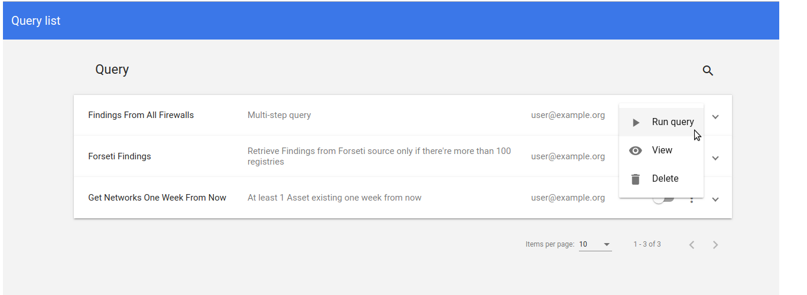
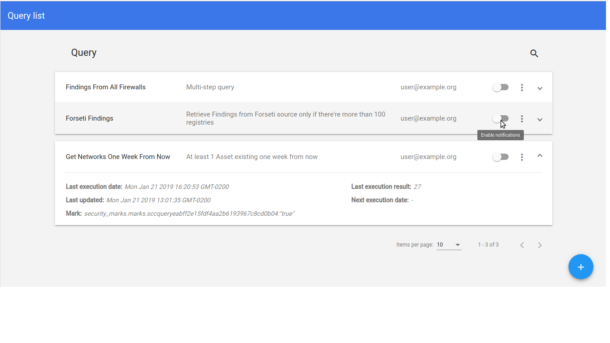
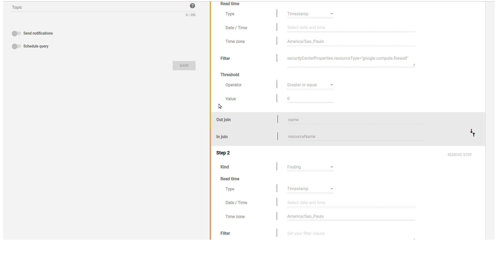
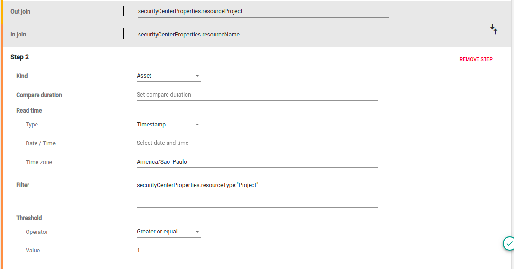
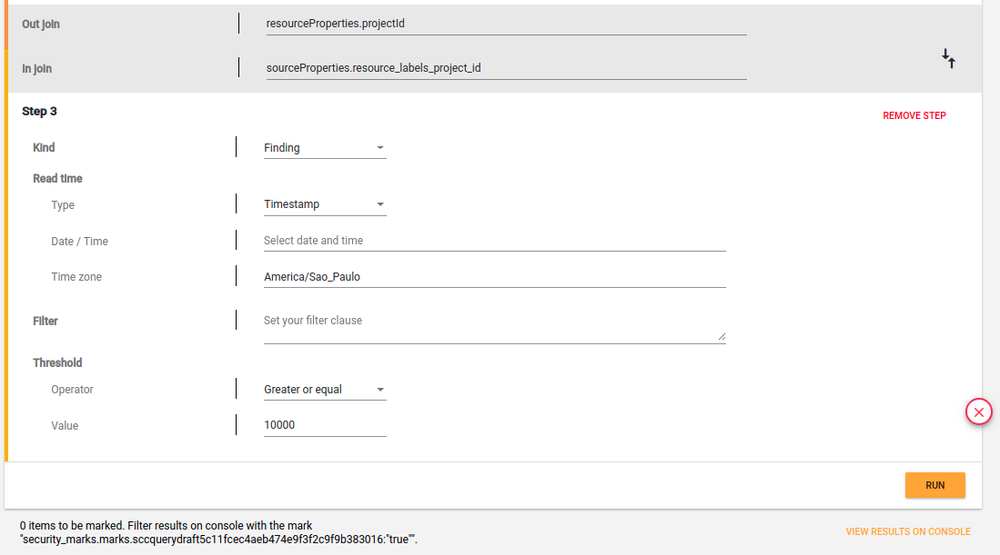

% SCC Tools: **Query Builder** User Guide
% Security Cloud Command Center Tools

\setcounter{section}{0}
\setcounter{secnumdepth}{10}
\newpage

# Introduction

Your can use the **Query Builder** application to create/update/delete multi-step queries for **Assets** and **Findings**. This registered queries may be used to execute searches in Security Command Center through the API.

The results from executed queries search are updated with security marks.

There's the possibility to run periodically searches with scheduled queries and being notified about the results.

## Initial Screen (List Queries)

The application initial page is a list of queries already saved that can be:

- Viewed/Edited
- Executed
- Deleted

{#fig:querybuilder_list_actions width=75% height=50%}

Each query has an expandable panel with additional information:

- Last execution date: the last time the query was executed, both trigger by the user or by the scheduler
- Last execution result: the total of Assets and/or Findings that satisfy the query steps and threshold found on the last execution
- Last updated: when the query information was update for the last time
- Next Execution date: For scheduled queries the next time it will be executed
- Mark: The pair of (key, value)  to be used in the Google Cloud Security Command Center to filter the results marked in the last query execution. It can be copied "as is" and pasted on the "Filter by" field on the console

{#fig:querybuilder_list_details width=75% height=50%}

It is also possible to:

- Using the search icon, filter the queries by name, description or owner
- Toggle to enable notifications after query execution
- Create a new query from scratch.

## Query Edit/Add Screen

A query is a set of consecutive steps, with each step been a call to either the SCC search assets or the SCC search findings API. Also composed by:

- A name _(required)_
- A description _(required)_
- An optional topic on format to be used in the notifications. Format accepted are:
  - **projects/{project-id}/topics/{topic-name}**: when publishing to a topic from another project
  - **{topic-name}**: when publishing to a topic from current **Query Builder** project
- A toggle to turn On and Off notifications
- A toggle to turn On and Off Scheduling a query
  - When turned on: detailed scheduling configuration

### Scheduling Configuration

Queries can be schedule by:

- Hour
- Day
- Week

For each one you can choose:

- the Frequency regarding the type
- An offset for the start of the execution

You can also see the next three future executions clicking on "SHOW NEXT EXECUTIONS".

### Query Steps

Each step is a call to the SCC API as described in the [Security Command Center documentation](https://cloud.google.com/security-command-center/docs/how-to-programmatic-access)

#### Kind field

Available options:

- ASSET
- FINDING

#### Compare duration field

Field only available for Assets responsible to define a time range to search, based ond the **\ref{sec:read_time_field}** field value being between the duration value. If no value is defined for **\ref{sec:read_time_field}**, it considers from current time (now).

More details at:

- [SCC API Asset Query parameters](https://cloud.google.com/security-command-center/docs/reference/rest/v1beta1/organizations.assets/list#query-parameters)

A Duration is a string in the format:

- {number}w+{number}d+{number}h+{number}m+{number}s

where

- *w* means weeks
- *d* means days
- *h* means hours
- *m* means minutes
- *s* means seconds

examples:

- 2w
- 24h+30m
- 48h
- 30m
- 30m+45s

#### Read Time field \label{sec:read_time_field}

Refers to the exact time the search will be executed. It can use a specific date/time or a value in the format w/d/h/m/s to search before now.

More details at:

- [SCC API Asset Query parameters](https://cloud.google.com/security-command-center/docs/reference/rest/v1beta1/organizations.assets/list#query-parameters)
- [SCC API Finding Query parameters](https://cloud.google.com/security-command-center/docs/reference/rest/v1beta1/organizations.sources.findings/list#query-parameters)

##### Type -> Timestamp

A pair of fields:

- Date + time in ISO format with a component to help fill the form
- A time zone filed with another component

##### Type -> From_now

A string in the format:

- {number}w+{number}d+{number}h+{number}m+{number}s

examples:

- 24h+30m
- 48h
- 30m
- 30m+45s

#### Filter field \label{sec:filter_field}

This field allows an expression base on the attributes, properties and security marks of the SCC items, Assets and Findings.

More details at:

- [SCC API Asset Query parameters](https://cloud.google.com/security-command-center/docs/reference/rest/v1beta1/organizations.assets/list#query-parameters)
- [SCC API Finding Query parameters](https://cloud.google.com/security-command-center/docs/reference/rest/v1beta1/organizations.sources.findings/list#query-parameters)

#### Threshold _(required)_

Each step also has a threshold that is used to define a condition upon which the size of the query result will be validate against. The threshold is a pair of the following operators and an integer value:

- 'Less than'
- 'Less or equal'
- 'Equal'
- 'Not equal'
- 'Greater or equal'
- 'Greater than'

#### Using Multiple Steps

It is possible to combine multiple calls to the SCC API adding steps to the query. When adding steps it will be necessary to define which field needs to be read from the result form the first query (out join). Also, which field on the second query will use the values from the first query (in join).

##### outJoin and inJoin

inJoin and outJoin fields must be a valid "**<field>**" as explained on [Asset](https://cloud.google.com/security-command-center/docs/reference/rest/v1beta1/organizations.assets/list#query-parameters) and [Finding](https://cloud.google.com/security-command-center/docs/reference/rest/v1beta1/organizations.sources.findings/list#query-parameters) API documentation.

The outJoin field must be a valid field on the first step, and the inJoin field must be a valid field on the second step.

The below image shows an example that should get the Findings, on step 2, based on returned Assets from step 1. So, _resourceName_ from Findings is the attribute that links with _name_ from Assets

{#fig:querybuilder_edit_joinfields width=75% height=50%}

# Query example

Here's an example of a multi-step query created on **Query Builder**.

The image \ref{fig:querybuilder_one_step_query} shows how to use filter and threshold fields to create a query.

The filter used search for assets with firewall as type, where TCP and port 443 where ingress allowed in a source range:

```bash
securityCenterProperties.resourceType:"Firewall" AND resourceProperties.allowed:"[{\"ipProtocol\":\"tcp\",\"port\":[\"443\"]}]" AND resourceProperties.sourceRange:"[\"0.0.0.0/0\"]" AND resourceProperties.direction="ingress"
```

{#fig:querybuilder_one_step_query width=75% height=50%}

Then, using the step 1, the image \ref{fig:querybuilder_two_steps_query} shows how to use inJoin and outJoin to add a new step on query, join result by project.

```bash
inJoin = securityCenterProperties.resourceProject
outJoin = securityCenterProperties.resourceName
```

The second step search for assets where type is project and exists on the first step result.

```bash
securityCenterProperties.resourceType:"Project"
```

{#fig:querybuilder_two_steps_query width=75% height=50%}

Finally, using the step 3, the image \ref{fig:querybuilder_three_steps_query} shows how to search all findings related to second query assets result join results by project id.

```bash
resourceProperties.projectId
sourceProperties.resource_labels_project_id
```

{#fig:querybuilder_three_steps_query width=75% height=50%}
